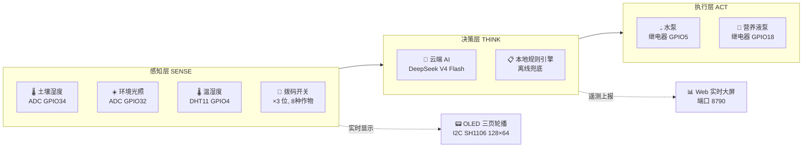

# 🚀 太空农业智能种植舱

**Space Agriculture Smart Planting Cabin**

> 基于 ESP32 + 云端 AI 的全自动植物养护 IoT 系统 | 14 种作物 · 双引擎决策 · 四级测试体系

[](https://micropython.org)
[](https://platform.deepseek.com)
[](./tests/)
[](./LICENSE)
[](#)

---

## 项目动机

在太空探索中，宇航员需要新鲜蔬菜补充营养——但太空舱里没人能 7×24 小时浇水施肥。

> **能不能让 AI 当植物学家，全天候照顾太空舱里的蔬菜？**

这就是太空农业智能种植舱的出发点。系统以 **ESP32 为下位机**，通过 **4 类传感器**实时感知环境，借助 **云端 DeepSeek 大模型 + 本地规则引擎**双重决策，驱动 **水泵和营养液泵**自动养护 14 种作物。从传感器到执行器、从 OLED 小屏到 Web 大屏，**全链路自主设计、全代码自主编写**。

项目面向 **STEM 科创教育**与**科技竞赛展示**（科学性 40 分 + 创新性 30 分 + 演讲 20 分 + 展示力 10 分）。

<p align="center">
  
  
  
</p>

<p align="center"><em>从左到右：Web 实时大屏 | OLED 三页轮播 | KT 展板设计</em></p>

---

## 系统架构



**核心循环**：每 60 秒采样一次 → 安全检查（防抖/限频/降级）→ 双引擎决策 → 执行动作 → OLED 刷新 + 大屏遥测上报

**AI 请求门控**：仅在阈值事件、环境明显变化或定时复核时才调用云端 AI，避免频繁请求。网络断开时自动切换本地规则，永不宕机。

---

## 🔥 五大技术亮点

| 亮点 | 描述 |
|:-----|:-----|
| 🧠 **AI + 规则双决策引擎** | DeepSeek V4 Flash 云端大模型 + 本地硬阈值兜底，断网时自动切换离线模式，确保系统永不离线 |
| 🌱 **14 种作物完整数据库** | `plants.json` 内置每种作物的生长阶段模型（苗期→生长期→花期→果期→采收期），3 位拨码开关一键切换，水肥策略自动适配 |
| 📊 **Web 实时数据大屏** | SVG 圆弧仪表 + 趋势曲线 + 植物生长动画 + 决策流水线，1920×1080 全屏展示，超 120 秒无数据自动切回 DEMO 模式 |
| 🛡️ **四级安全机制** | 看门狗重启 / 动作防抖（60s 间隔）/ 每小时动作上限（12 次）/ 传感器离线降级（自动切安全值）——确保 7×24 小时无人值守可靠运行 |
| 🔬 **四级测试体系** | ① ESP32 REPL 单模块验证 ② PC 端 pytest 自动化（50 个用例 ALL PASS，MicroPython Mock 注入）③ 系统集成测试 ④ 72 小时长稳验收 |

---

## 🛠 技术栈

| 分层 | 技术 | 说明 |
|:-----|:-----|:-----|
| **主控** | ESP32 DevKit v1 | Xtensa LX6 双核 240MHz, 520KB SRAM, WiFi 内置 |
| **传感器** | 电容式土壤 v1.2 + HS-S20L-B 光敏 + DHT11 | 土壤湿度/光照/温湿度，共 3 类 4 个传感器 |
| **执行器** | 5V 潜水泵 + 12V 隔膜泵 + 双继电器 | 低电平触发，带安全超时保护 |
| **显示** | SH1106 I2C OLED 128×64 + 红绿双色 LED | 三页轮播（传感器/生长/系统状态）|
| **固件** | MicroPython · 13 个模块化文件 | 按启动/主循环/感知/决策/执行/显示/遥测拆分，单一职责 |
| **AI** | DeepSeek V4 Flash + 代理中转 | ¥1/百万 tokens · 支持 HTTP 代理（无 TLS 压力）或直连 |
| **前端** | HTML5 + CSS3 + SVG + Canvas | 实时大屏端口 8790，Python HTTP Server 托管 |
| **测试** | pytest 50 用例 + MicroPython Mock | `conftest.py` 注入 machine/network/DHT 等模拟 |
| **工具链** | mpremote + esptool | MicroPython 固件烧录、文件上传、REPL 调试 |

**硬件成本**：¥135/套（批量采购可压至 ¥110/套以内），详见 [选型报告](./智能种植舱控制器选型报告.md#三4-完整-bom-汇总)。

---

## ⚡ 快速开始

### 1. 启动 Web 实时大屏

```powershell
py tools/dashboard_server.py --host 0.0.0.0 --port 8790
```

浏览器打开 `http://127.0.0.1:8790/`，大屏即启动。Windows 可用脚本一键启动：

```powershell
powershell -ExecutionPolicy Bypass -File tools\start_dashboard_server.ps1
```

> 详细部署说明见 [大屏部署指南](./deliverables/realtime-dashboard-guide.md)

### 2. 配置 ESP32

```bash
# 复制配置模板
cp esp32_firmware/config.py.example esp32_firmware/config.py

# 编辑 config.py，填写 WiFi 和 AI API 密钥
```

```python
AI_PROXY_URL = "http://43.156.68.157:8787/decision"  # 代理中转（推荐）
DASHBOARD_URL = "http://43.156.68.157:8790/api/state"
```

> 完整烧录和接线说明见 [固件 README](./esp32_firmware/README.md)

### 3. 运行自动化测试

```powershell
py -m pytest
```

预期输出：**50 passed**

---

## 📁 项目结构

```text
太空农业种植舱项目/
├── esp32_firmware/          # ESP32 MicroPython 固件（13 模块）
│   ├── main.py              # 主入口 · 依赖注入接线
│   ├── boot_runtime.py      # 启动序列编排
│   ├── loop_runtime.py      # 主循环调度（采样→决策→执行→遥测）
│   ├── sensors.py           # 传感器底层读取（土壤/光照/DHT/拨码）
│   ├── actuators.py         # 执行器底层控制（水泵/营养液泵）
│   ├── decision.py          # 决策编排（AI门控 + 本地规则兜底）
│   ├── action_runtime.py    # 动作执行 + 安全检查
│   ├── display.py           # OLED 页面绘制（英文三页轮播）
│   ├── telemetry.py         # Web 大屏实时遥测上报
│   ├── ai_client.py         # DeepSeek API 客户端 + 代理中转
│   ├── config.py.example    # 配置模板（WiFi/AI/引脚）
│   └── plants.json          # 14 种植物完整参数数据库
├── tests/                   # pytest 自动化测试（50 用例 ALL PASS）
│   ├── conftest.py          # MicroPython Mock 注入层
│   ├── test_ai_parse.py     # AI 响应解析
│   ├── test_config.py       # 配置 + 植物数据库
│   ├── test_local_decision.py # 本地决策逻辑
│   └── test_loop_runtime.py # 主循环边界
├── tools/                   # PC 端辅助工具
│   ├── dashboard_server.py  # 实时大屏 HTTP 服务器
│   └── ai_proxy.py          # AI HTTP 代理中转服务器
├── deliverables/            # 比赛交付物（大屏/KT板/评委材料）
│   ├── contest-demo-dashboard.html  # Web 实时大屏
│   ├── KT板展示设计-最新版.md       # KT 板完整设计规范
│   ├── 评委展示方案.md              # 30秒电梯演讲 + 3分钟话术
│   └── 实机验收清单.md              # 比赛前硬件验收 Checklist
├── 智能种植舱控制器选型报告.md  # 硬件选型/接线/BOM/架构
└── 测试指南.md                # 四级测试体系详细说明
```

### 📖 文档导航

| 你需要… | 去看… |
|:---------|:------|
| 了解项目如何接线和选型 | [智能种植舱控制器选型报告](./智能种植舱控制器选型报告.md) |
| 烧录固件、配置 ESP32 | [esp32_firmware/README.md](./esp32_firmware/README.md) |
| 部署 Web 实时大屏 | [deliverables/realtime-dashboard-guide.md](./deliverables/realtime-dashboard-guide.md) |
| 准备比赛答辩 | [deliverables/评委展示方案.md](./deliverables/评委展示方案.md) |
| 比赛前硬件验收 | [deliverables/实机验收清单.md](./deliverables/实机验收清单.md) |
| 设计 KT 展板 | [deliverables/KT板展示设计-最新版.md](./deliverables/KT板展示设计-最新版.md) |
| 了解测试体系 | [测试指南](./测试指南.md) |
| 查看交付物全貌 | [deliverables/README.md](./deliverables/README.md) |

---

## 📊 数据见证

| 指标 | 数值 |
|:-----|:-----|
| 自动化测试 | **50 个用例 ALL PASS** |
| 支持作物 | **14 种**（叶菜 5 + 果菜 6 + 根茎 3），每种含 3-5 个生长阶段 |
| 固件模块 | **13 个**，单文件最大约 300 行 |
| 代码总量 | MicroPython ~3000 行 + HTML/CSS/JS ~2500 行 |
| 硬件成本 | **¥135/套** |
| 实机运行 | 超过 **18 天**连续运行 |

---

## 开源协议

本项目采用 [MIT License](./LICENSE) 开源。

---

<p align="center">
  <sub>Built with ❤️ for STEM education and space exploration</sub>
</p>