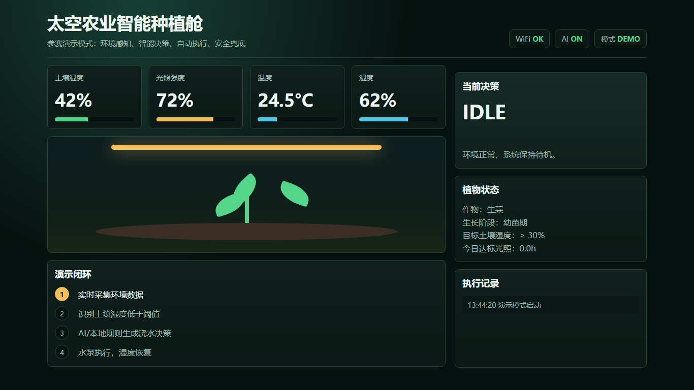
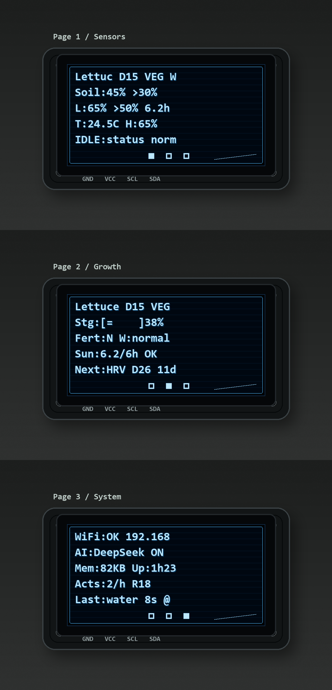
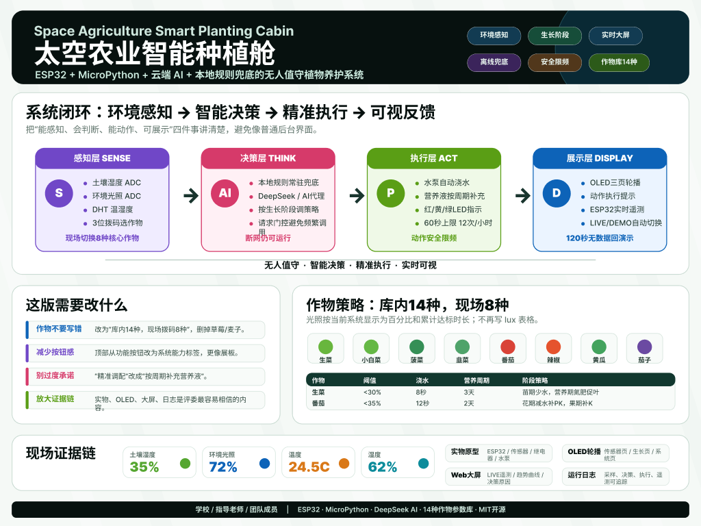
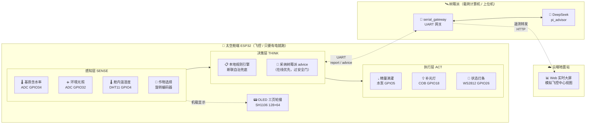

# 🌱《2035 · 我是太空育种师》

> **作品名** ｜ 科创赛主题《2035年的我》—— 三名队员扮演 2035 年太空育种站的农业育种专家 / 总工程师 / 育种站长
>
> **系统名:太空农业智能育种舱**（Space Breeding Cabin 2035）

> 一座"在轨太空育种验证舱"的地面原型：ESP32 飞控 + 树莓派调用 DeepSeek AI，让育种与选种直接在舱里完成、多快好省地为全人类选育良种 | 太空育种 · 加快反馈周期 · 双层自治 · 8 种作物

[](https://micropython.org)
[](https://platform.deepseek.com)
[](./tests/)
[](./LICENSE)
[](#)

---

## 立意：一万年 → 五个月

> 人类一万年来在干同一件事：**缩短"想要一个性状"到"得到一个性状"之间的时间**——也就是育种反馈的速度。

| 时代 | 育种手段 | 一个新品种的反馈周期 |
|:---|:---|:---:|
| 公元前 8000 年 · 自然驯化 | 留种 → 重播 | **~10000 年** |
| 1865 年 · 孟德尔遗传规律 | 定向杂交 | ~10 年 |
| 1973 年 · 杂交水稻（袁隆平） | 大规模杂交 + 田间筛选 | 5–10 年 |
| 1987 年 · 中国首次太空诱变 | 宇宙射线 + 地面 5–8 代筛选 | 5–8 年 |
| 2012 年 · CRISPR 基因编辑 | 精准修改特定碱基 | 数月 |
| 2020s · AI + 基因组预测 | 算法预测基因型 → 表型 | 数周 |
| 2035 ?? · **在轨育种验证平台** | 太空诱变 + 太空种植 + AI 实时筛选 | **数月** |

太空育种已经是中国领先的领域（"实践八号"育种卫星 + 240 多个航天育种品种），但有一个尚未打通的瓶颈：**种子搭上去飞一圈，回到地面还要再种 5–8 代才能筛出有价值的突变**——反馈速度被"搭载机会"卡死。

如果种植和验证本身就发生在太空舱里，反馈周期可以再砍掉一个量级。

**这个项目是那个未来"在轨育种验证平台"的地面雏形**——一个能 7×24 自治、能精确记录每一棵作物每一天数据的小型种植舱。今天它是教育原型，明天它的控制架构可以直接迁移到轨道实验舱。

## 为什么是"太空"农业？

在月球基地、火星前哨或长期空间站任务中，新鲜蔬菜不仅是营养补给，更是宇航员心理健康的支柱；**更重要的是，太空舱本身就是人类找到的最强诱变源**——宇宙射线能量比地面 X 光高几个数量级，微重力 + 高真空让 DNA 修复机制运行异常，突变频率比地面诱变高 3–4 倍，突变谱也更宽。

但"在太空种菜 + 在太空育种"面临的挑战与地面温室**完全不同**：

| 维度 | 地面温室 | 太空（空间站 / 月面 / 火星） |
|:-----|:---------|:-----------------------------|
| 🌀 **重力** | 1g，水靠重力下渗 | 微重力/低重力，水形成液滴漂浮，根系方向紊乱 |
| 🌬️ **大气** | 开放，可补充 CO₂ | 密闭循环，CO₂/O₂/湿度必须精确平衡 |
| ⚡ **能源** | 几乎无限 | 极度受限，每瓦特都要为科研和生保让步 |
| 👨‍🚀 **人力** | 随时干预 | 宇航员时间昂贵（~$130,000/h），作物管理必须自治 |
| 📡 **通信** | 实时 | 火星距离地球 4-24 分钟延迟，无法依赖地面实时控制 |
| 🔧 **容错** | 坏了换新的 | 坏了没人修，必须可降级运行 |
| ♻️ **资源** | 水肥充足 | 水、营养液极度稀缺，必须闭环回收 |

> **一个地球上的智能花盆用"定时浇水"就够。一个配得上"太空"二字的系统，必须回答：**断网了怎么办？传感器坏了怎么办？功耗超了怎么办？宇航员没空管的时候怎么办？

### 我们的设计回应

本项目以 ESP32 为核心，构建一个**可断联自治、可故障降级、可远程遥测**的小型种植舱原型。我们将每一项太空约束都映射为具体的设计选择：

| 太空约束 | 设计选择 | 实现方式 |
|:---------|:---------|:---------|
| 📡 通信延迟 & 不可靠 | **双层决策架构** | 云端 AI 在线时精细优化；断联时本地规则引擎自动接管，模拟深空延迟下的自治运行 |
| 👨‍🚀 人力昂贵 | **全自动养护闭环** | 感知→决策→执行全链路自动化，旋转编码器一键切换 8 种作物，无需人工配置 |
| 🔧 故障无人维修 | **四级容错与降级** | 传感器离线→自动切安全值；执行器故障→跳过继续运行；看门狗→死机自动重启 |
| ⚡ 能源稀缺 | **采样与决策节流** | 采样周期 60s，AI 请求门控（阈值触发+周期复核），非必要时不浪费带宽和电力 |
| ♻️ 资源浪费不可接受 | **精量滴灌 + 智能补光 + 安全上限** | 最小水量/补光释放，水泵/补光单次最长均为 20s、每小时最多 12 次动作，避免过量浇水或浪费 |
| 🧪 多作物轮种需求 | **8 种作物完整数据库** | 每作物独立生长阶段模型（苗期→生长期→花期→果期→采收期），旋转编码器现场一键切换 |

系统以 **ESP32 为下位机**，通过 **4 类传感器**实时感知环境，借助 **云端 DeepSeek 大模型 + 本地规则引擎**双重决策，驱动 **12V 水泵 + 12V 补光灯**自动浇水补光养护 **8 种作物**（旋转编码器现场切换）。**Decision Plane / Action Plane 分离架构**：决策层输出多维诊断信号（缺水、缺光、高温、缺肥等），物理执行器仅响应 WATER/LIGHT_LOW 两种信号，其余 advisory 信号通过 WS2812 灯条动画广播——实现「决策能力与执行能力分离」。OLED 三页轮播 + **WS2812 11 颗灯珠**作为机载仪表，Web 大屏作为地面遥测/育种科学家数据看板——形成一套面向**多品种平行筛选 + 全生长周期数据闭环**的最小化育种实验平台原型。

项目面向 **STEM 科创教育**与**科技竞赛展示**（科学性 40 分 + 创新性 30 分 + 演讲 20 分 + 展示力 10 分）。

<p align="center">
  
  
  
</p>

<p align="center"><em>从左到右：Web 实时大屏 | OLED 三页轮播 | KT 展板设计</em></p>

---

## 系统架构



> **自治边界**：ESP32（左框）保留传感器、执行器、本地规则和安全护栏，**断网断树莓派也能种活作物**。树莓派/云端承担联网、大屏、AI——挂了只是变笨/看不到。大屏只读，不向 ESP32 下发控制命令。

**核心循环**：每 60 秒采样 → 安全检查（防抖/限频/降级）→ 决策（在线 Pi advice 优先，否则本地规则）→ 执行动作 + WS2812 信号广播 → OLED 刷新 + 经 UART 把 report 发给树莓派转发大屏

**三层降级**：① 树莓派调 DeepSeek（最聪明）→ ② 树莓派阈值规则 → ③ ESP32 本地规则（板上常驻）。任何一层断了下一层接住，模拟深空 4-24 分钟延迟下的全自治。

---

## 🔥 五大技术亮点

| 亮点 | 地面视角 | 🚀 太空视角 |
|:-----|:---------|:------------|
| 🧠 **AI + 规则双决策引擎** | 网络断了自动切本地规则 | 模拟深空通信延迟——火星 4-24 分钟延迟下，地面无法实时干预，必须本地全自治决策 |
| 🌱 **8 种作物生长阶段模型** | 旋转编码器现场一键切换 | 宇航员无需任何农业知识——一拨开关，系统自动匹配从苗期到采收期的完整水肥策略 |
| 🛡️ **四级容错与降级机制** | 传感器坏了切安全值 | 在轨无人维修——传感器离线自动降级为安全模式，看门狗死机重启，执行器故障安全跳过 |
| 📊 **Decision Plane / Action Plane 分离** | 决策层广播多维信号，执行层仅响应物理动作 | 决策能力与执行能力分离——缺肥/高温等 advisory 信号即时广播，无需等待执行器就位 |
| 📊 **Web 实时遥测大屏** | 远程看传感器数据 | 模拟休斯顿/北京飞控中心——SVG 仪表 + 趋势曲线 + 决策信号面板，超 120s 无数据自动切 DEMO |
| 🔬 **四级测试体系 + 故障演练** | pytest 自动化测试 | 在轨故障预案验证——通过 Mock 注入模拟断网、传感器失效、执行器卡死等场景，133 用例 ALL PASS |

---

## 🛠 技术栈

| 分层 | 技术 | 说明 |
|:-----|:-----|:-----|
| **主控** | ESP32 DevKit v1 | Xtensa LX6 双核 240MHz, 520KB SRAM, WiFi 内置 |
| **传感器** | 电容式土壤 v1.2 + HS-S20L-B 光敏 + DHT11 | 土壤湿度/光照/温湿度，共 3 类 4 个传感器 |
| **执行器** | 12V 蠕动泵 + 12V COB 补光灯 + 双继电器 | 低电平触发，带安全超时 + 温度护栏 |
| **显示** | SH1106 I2C OLED 128×64 + WS2812 11 灯珠灯条 | 三页轮播 + 湿度温度计 + 决策信号动画广播 |
| **固件** | MicroPython · 模块化文件 | 按启动/主循环/感知/决策/执行/显示/UART 拆分，单一职责 |
| **AI** | DeepSeek V4 Flash（运行在树莓派侧） | ¥1/百万 tokens · 由树莓派 `pi_advisor` 调用，ESP32 不再直连（无 TLS 内存压力） |
| **上位机** | 树莓派 + `serial_gateway` | UART 收 report / 调 DeepSeek 回 advice / 转发大屏 |
| **前端** | HTML5 + CSS3 + SVG + Canvas | 实时大屏端口 8790，Python HTTP Server 托管 |
| **测试** | pytest 133 用例 + MicroPython Mock | `conftest.py` 注入 machine/network/DHT 等模拟 |
| **工具链** | mpremote + esptool | MicroPython 固件烧录、文件上传、REPL 调试 |

**硬件成本**：¥140/套（批量采购可压至 ¥125/套以内），详见 [选型报告](./智能种植舱控制器选型报告.md#三4-完整-bom-汇总)。

---

## ⚡ 快速开始

### 1. 启动 Web 实时大屏

```powershell
py tools/dashboard_server.py --host 0.0.0.0 --port 8790
```

浏览器打开 `http://127.0.0.1:8790/`，大屏即启动。Windows 可用脚本一键启动：

```powershell
powershell -ExecutionPolicy Bypass -File tools\start_dashboard_server.ps1
```

> 🛰️ **地面站监控大屏**：`deliverables/groundstation.html` 是 retro-futuristic 航天控制台风格的实时大屏（已部署云端 `43.156.68.157:8790`），轮询同一 `/api/state` 接口，显示传感器/生长曲线/DeepSeek 多维决策/育种团队。dashboard_server 在 `/` 服务该 HTML。详见 [DEVLOG/2026-05-31.md](./DEVLOG/2026-05-31.md) #44。
> 详细部署说明见 [大屏部署指南](./deliverables/realtime-dashboard-guide.md)

### 2. 启动树莓派 UART 网关（双层架构的核心，必需）

ESP32 不再自己联网——联网、大屏、AI 全部由树莓派经 UART 承担。按架构文档连接 UART2：
ESP32 GPIO17 → 树莓派 GPIO15/RXD，ESP32 GPIO16 ← 树莓派 GPIO14/TXD，**GND 共地**。

树莓派上运行网关（DeepSeek 在 Pi 侧调用，key 走环境变量）：

```bash
export SPACEFARM_AI_API_KEY="sk-..."                 # DeepSeek key（不进命令行）
export SPACEFARM_DASHBOARD="http://43.156.68.157:8790/api/state"
python3 tools/serial_gateway.py --port /dev/serial0 --baud 115200 --ai-advice
```

Windows 调试串口可用：

```powershell
py tools\serial_gateway.py --port COM5 --test-advice water --test-duration 8
```

决策三层降级：`--ai-advice` 让 Pi 调 **DeepSeek**（最聪明）；AI 失败自动回退 `--auto-advice` 的**阈值规则**；UART 断了 ESP32 还有**本地规则**兜底。`--test-advice water` 只下发一次浇水建议，用于验收“树莓派能让 ESP32 执行动作”。

> ✅ **2026-05-30 实机验收通过**：`/dev/serial0` report/ping/pong/advice 全链路跑通，ESP32 `ai_src` 变 `pi`。部署时按顺序排查三点（详见 [ARCHITECTURE.md §1.2](./ARCHITECTURE.md#12-树莓派端部署要点2026-05-30-实机验收通过)）：
> 1. **共地接牢、TX/RX 交叉**——否则 Pi 的 RX 悬空，只读到持续 `0xFF` 噪声；
> 2. **释放内核控制台**——`sudo sed -i 's/console=serial0,115200 //' /boot/firmware/cmdline.txt` + 重启 + `disable serial-getty@ttyS0`，否则 ttyS0 被锁 600 且双向流量被控制台争用打断；
> 3. **避让进程沙箱/看门狗**——如有 openclaw 这类硬件看门狗，URL 用环境变量 `SPACEFARM_DASHBOARD` 经 systemd `Environment=` 传入，避免 `--dashboard` 里的 `board` 子串被误杀。
>
> 开机自启：装成 systemd 服务 `spacefarm-gateway.service`（`Environment=SPACEFARM_DASHBOARD=...` + `--auto-advice`），已验证云端大屏 `live:true` 实时刷新。

### 3. 配置 ESP32

```bash
# 复制配置模板
cp esp32_firmware/config.py.example esp32_firmware/config.py
```

ESP32 端配置已大幅精简——**不再有 WiFi/AI/Dashboard 密钥**（这些都搬到了树莓派侧）。`config.py` 只剩 UART、传感器/执行器引脚、安全护栏、作物列表等。DeepSeek 的 key/model 改在树莓派用 `SPACEFARM_AI_*` 环境变量配置（见上一步）。

> 完整烧录和接线说明见 [固件 README](./esp32_firmware/README.md)

> ⚠️ **电源建议**：12V 水泵/灯继电器与 ESP32 共用 USB 5V 时会触发 brownout 复位；
> 强烈建议 12V 走独立适配器，ESP32 VIN 加 1000µF 退耦电容，继电器线圈反接 1N4007。
> 详见 [ARCHITECTURE.md §12](./ARCHITECTURE.md#12-电源域与已知硬件干扰风险) 与 [DEVLOG/2026-05-29.md](./DEVLOG/2026-05-29.md) #33。

### 4. 运行自动化测试

```powershell
py -m pytest
```

预期输出：**144 passed**

---

## 📁 项目结构

```text
太空农业种植舱项目/
├── ARCHITECTURE.md          # 系统架构设计文档
├── TASKS.md                 # 当前任务与待办
├── DEVLOG/                  # 开发日志（按日期）
│   ├── 2026-05-28.md        # Decision/Action Plane 架构升级
│   ├── 2026-05-29.md        # WiFi/brownout 排查 + 菜单交互
│   └── 2026-05-30.md        # 树莓派双层 UART 接入 + 实机验收（共地/控制台/看门狗）
├── esp32_firmware/          # ESP32 MicroPython 固件（13 模块）
│   ├── main.py              # 主入口 · 依赖注入接线
│   ├── boot_runtime.py      # 启动序列编排
│   ├── loop_runtime.py      # 主循环调度（采样→决策→执行→遥测）
│   ├── sensors.py           # 传感器底层读取（土壤/光照/DHT/旋转编码器）
│   ├── actuators.py         # 执行器底层控制（12V 水泵 + 12V 补光灯双继电器）
│   ├── status_strip.py      # WS2812 状态灯条（湿度温度计 + 决策信号动画）
│   ├── decision.py          # 决策编排（AI门控 + 本地规则兜底）
│   ├── action_runtime.py    # 动作执行 + 安全检查
│   ├── display.py           # OLED 页面绘制（英文三页轮播 + 菜单渲染）
│   ├── display_runtime.py   # OLED 生命周期管理（懒初始化 + advance_page）
│   ├── buttons.py            # ADC 模拟键盘驱动（单 GPIO33 四键 + nav_held 长按加速）
│   ├── menu.py               # OLED 菜单系统（植物/天数/手动控制/系统信息，蓝键统一返回）
│   ├── telemetry.py         # Web 大屏实时遥测上报
│   ├── uart_link.py         # ESP32<->树莓派 UART JSON-over-Line 协议层
│   ├── ai_client.py         # DeepSeek API 客户端 + 代理中转
│   ├── config.py.example    # 配置模板（WiFi/AI/引脚）
│   └── plants.json          # 8 种植物完整参数数据库
├── tests/                   # pytest 自动化测试（144 用例 ALL PASS）
│   ├── conftest.py          # MicroPython Mock 注入层
│   ├── test_ai_parse.py     # AI 响应解析
│   ├── test_config.py       # 配置 + 植物数据库
│   ├── test_local_decision.py # 本地决策逻辑
│   └── test_loop_runtime.py # 主循环边界
├── tools/                   # PC 端辅助工具
│   ├── dashboard_server.py  # 实时大屏 HTTP 服务器
│   ├── serial_gateway.py    # 树莓派串口网关（收 report / 发 advice / 心跳）
│   └── ai_proxy.py          # AI HTTP 代理中转服务器
├── deliverables/            # 比赛交付物（大屏/KT板/评委材料）
│   ├── contest-demo-dashboard.html  # Web 实时大屏
│   ├── KT板展示设计-最新版.md       # KT 板完整设计规范
│   ├── 评委展示方案.md              # 30秒电梯演讲 + 3分钟话术
│   └── 实机验收清单.md              # 比赛前硬件验收 Checklist
├── 智能种植舱控制器选型报告.md  # 硬件选型/接线/BOM/架构
└── 测试指南.md                # 四级测试体系详细说明
```

### 📖 文档导航

| 你需要… | 去看… |
|:---------|:------|
| **30 秒看懂全局（项目地图）** | [**项目总览.md**](./项目总览.md) |
| 了解项目如何接线和选型 | [智能种植舱控制器选型报告](./智能种植舱控制器选型报告.md) |
| 烧录固件、配置 ESP32 | [esp32_firmware/README.md](./esp32_firmware/README.md) |
| 部署 Web 实时大屏 | [deliverables/realtime-dashboard-guide.md](./deliverables/realtime-dashboard-guide.md) |
| 准备比赛答辩（话术 + 现场演示 + Q&A） | [deliverables/评委展示方案.md](./deliverables/评委展示方案.md) |
| 5 年级专用：育种叙事背诵手册 | [deliverables/育种叙事-背诵手册.md](./deliverables/育种叙事-背诵手册.md) |
| 比赛前 7 天倒计时清单 | [deliverables/比赛前7天-倒计时清单.md](./deliverables/比赛前7天-倒计时清单.md) |
| 比赛前硬件验收 | [deliverables/实机验收清单.md](./deliverables/实机验收清单.md) |
| 设计 KT 展板 | [deliverables/KT板展示设计-最新版.md](./deliverables/KT板展示设计-最新版.md) |
| 了解测试体系 | [测试指南](./测试指南.md) |
| 查看系统架构设计 | [ARCHITECTURE.md](./ARCHITECTURE.md) |
| 查看开发日志 | [DEVLOG/](./DEVLOG/) |
| 查看当前任务 | [TASKS.md](./TASKS.md) |
| 查看交付物全貌 | [deliverables/README.md](./deliverables/README.md) |

---

## 📊 数据见证

每一项工程指标都对应"在轨育种验证平台"的一个能力维度：

| 指标 | 数值 | 育种平台能力解读 |
|:-----|:-----|:-----------------|
| 自动化测试 | **133 个用例 ALL PASS** | 科研级数据可靠性保证，含断网/传感器失效/温度安全护栏/Decision Plane 信号故障预案 |
| 支持作物 | **8 种**（叶菜 4 + 果菜 4） | **多品种平行筛选能力** |
| 生长阶段模型 | 每作物 **3-5 个阶段** | **全生长周期数据闭环**（苗期→营养→花期→果期→采收期）|
| 容错能力 | 传感器离线降级 + 看门狗 + 动作限频 | 长周期育种实验不被中断 |
| 决策延迟 | DeepSeek（树莓派调用）< 3s，本地规则 < 1ms | 实时筛选有价值的突变性状；满足深空 4-24 分钟通信延迟 |
| 采样周期 | **60 秒**采样一次 | **高密度生长数据采集**，远超人工观测密度 |
| 固件模块 | **十余个**，单文件最大约 300 行 | 模块化，便于在轨远程热更新维护 |
| 硬件成本 | **¥140/套** | 低成本批量部署，覆盖更多品种平行实验 |
| 实机运行 | 超过 **18 天**连续运行 | 跑通一个完整速生菜生长周期 |

---

## 开源协议

本项目采用 [MIT License](./LICENSE) 开源。

---

<p align="center">
  <sub>Built for STEM education · Designed for deep space</sub>
</p>
