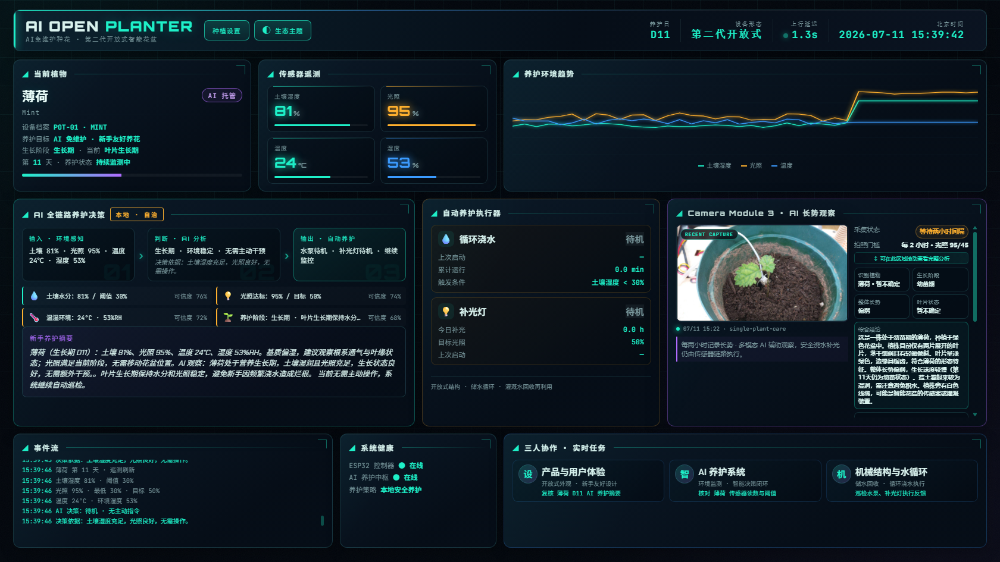
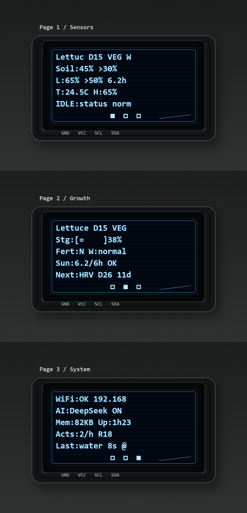
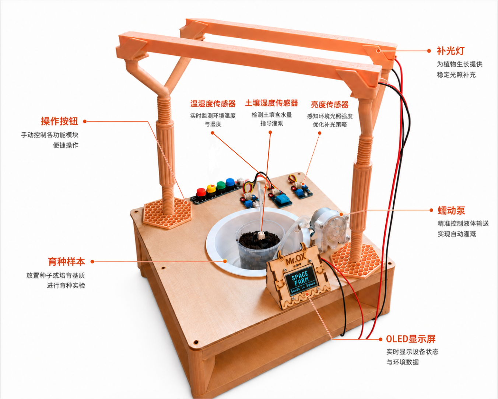
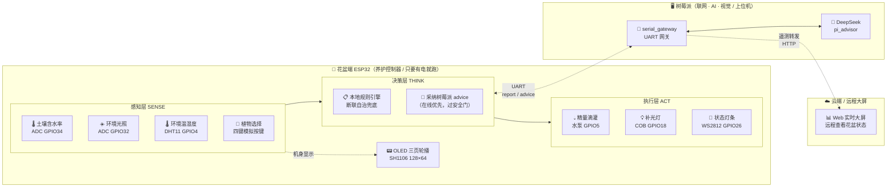

# 🌱 第二代开放式智能花盆

> **作品名** ｜ AI 免维护种花 · 第二代开放式智能花盆
>
> **一句话**：把养花老手的经验装进一只花盆——ESP32 本地养护 + 树莓派调用 DeepSeek AI + 摄像头看长势，让不会养花的人也能把花养好 | 新手免维护 · 断网也不断档 · AI＋本地规则双层决策 · 开放式储水循环 · 8 套植物养护模型

[](https://micropython.org)
[](https://platform.deepseek.com)
[](./tests/)
[](./LICENSE)
[](#)

---

## 立意：花，为什么总被养死？

> 养花不难，难的是**日复一日按它的需要照顾它**——而这恰恰是新手最容易失手的地方。

超过一半的家庭盆栽不是"养不活"，而是**被人为养死**的，三个头号死因：

| 痛点 | 为什么发生 |
|:---|:---|
| 💧 **忘浇水 / 浇太多** | 凭感觉浇水——旱死，或烂根，新手最常见 |
| ☀️ **光照不对** | 徒长、黄叶、不开花，问题出在哪肉眼看不出来 |
| 🧳 **出差 / 假期没人管** | 一趟长假回来，花已经救不活了 |

花盆自己也一直在进化：**传统花盆**全靠记性和经验 → **定时浇水盆**到点就浇、不看天不看土 → 我们做的**第二代开放式智能花盆**：先感知、再思考、后动手，浇水依据从"感觉/闹钟"升级为"**数据 ＋ AI**"。

**一句话定位：把养花老手的经验，装进一只花盆。**

## 为什么是"开放式"？

市面上大多智能花盆是"密闭一体机"，好看但**只能定时浇水、水浇下去就流走浪费了**。我们坚持**开放式结构 + 储水循环**：花盆是熟悉的样子，谁都会用；底部储水箱把灌溉水回收再利用，**浇下去的水一滴不浪费**——这在缺水地区和长期无人养护时尤其重要。

真正拉开差距的不是"会浇水"，而是回答这几个问题：**断网了还能不能养？传感器坏了怎么办？主人一个月不在家怎么办？浇多浇少谁来把关？** 这些正是普通"定时浇水盆"答不了、而我们逐一用设计回应的地方。

### 我们的设计回应

本项目以 ESP32 为核心，构建一个**可断网自治、可故障降级、可远程查看**的开放式智能花盆。我们把每一个养花痛点都映射为具体的设计选择：

| 养花痛点 / 真实场景 | 设计选择 | 实现方式 |
|:---------|:---------|:---------|
| 🧳 出差、长假没人管 | **断网自治的双层决策** | 云端 AI 在线时精细优化；断网时 ESP32 本地规则引擎自动接管，没网也能把花养好 |
| 🌱 新手不懂怎么养 | **全自动养护闭环** | 感知→决策→执行全链路自动化，四键模拟按键一键切换植物，无需人工配置阈值 |
| 🔧 传感器 / 硬件会坏 | **四级容错与降级** | 传感器离线→自动切安全值；执行器故障→跳过继续运行；看门狗→死机自动重启 |
| ⚡ 想省电、长期运行 | **采样与决策节流** | 采样周期 60s，AI 请求门控（阈值触发+周期复核），非必要不浪费带宽和电力 |
| ♻️ 浇水浪费、缺水地区 | **精量滴灌 + 储水回收 + 安全上限** | 最小水量释放，灌溉水回流复用，水泵/补光单次最长 20s、每小时最多 12 次动作 |
| 🪴 不同植物养法不同 | **8 套植物养护模型** | 每种植物独立生长阶段模型（苗期→生长期→花期→果期→采收期），一键现场切换 |

系统以 **ESP32 为下位机**，通过 **4 类传感器**实时感知环境，借助 **云端 DeepSeek 大模型 + 本地规则引擎**双重决策，驱动 **12V 水泵 + 12V 补光灯**自动浇水补光养护植物（四键模拟按键现场切换 8 套养护模型）。**Decision Plane / Action Plane 分离架构**：决策层输出多维诊断信号（缺水、缺光、高温、缺肥等），物理执行器仅响应 WATER/LIGHT_LOW 两种信号，其余 advisory 信号通过 WS2812 灯条动画广播——实现「决策能力与执行能力分离」。OLED 三页轮播 + **WS2812 11 颗灯珠**作为机身仪表，让新手一眼看懂花盆状态；Web 大屏作为远程数据看板，随时查看这盆花此刻的处境。

项目面向 **STEM 科创教育**与**科技竞赛展示**（科学性 40 分 + 创新性 30 分 + 演讲 20 分 + 展示力 10 分）。

> 📌 **关于"8 套植物养护模型"**：当前模型库是 8 种蔬菜（叶菜 4 + 果菜 4）——蔬菜生长快、阶段分明，便于在比赛周期内跑通完整生长周期做验证，且"阳台种菜"本身就是真实家庭需求。养护逻辑（按生长阶段调水/光/肥）对观花植物完全通用，换一套参数即可扩展。我们不谎称库里是花。

<p align="center">
  
  
  
</p>

<p align="center"><em>从左到右：Web 远程大屏 | OLED 三页轮播 | 智能花盆实物</em></p>

---

## 系统架构


```mermaid
flowchart LR
    subgraph SPACE["🌱 花盆端 ESP32（养护控制器 / 只要有电就跑）"]
        subgraph SENSE["感知层 SENSE"]
            Soil["🌡️ 土壤含水率<br/>ADC GPIO34"]
            LightS["☀️ 环境光照<br/>ADC GPIO32"]
            DHT["🌡️ 环境温湿度<br/>DHT11 GPIO4"]
            DIP["🔢 植物选择<br/>四键模拟按键"]
        end

        subgraph THINK["决策层 THINK"]
            Local["📋 本地规则引擎<br/>断联自治兜底"]
            PiAdv["📡 采纳树莓派 advice<br/>（在线优先，过安全门）"]
        end

        subgraph ACT["执行层 ACT"]
            Pump["💧 精量滴灌<br/>水泵 GPIO5"]
            Lamp["💡 补光灯<br/>COB GPIO18"]
            Strip["🌈 状态灯条<br/>WS2812 GPIO26"]
        end

        SENSE --> THINK
        THINK --> ACT
        SENSE -.->|机身显示| OLED["📟 OLED 三页轮播<br/>SH1106 128×64"]
    end

    subgraph PI["🖥️ 树莓派（联网 · AI · 视觉 / 上位机）"]
        GW["🔌 serial_gateway<br/>UART 网关"]
        AI["🤖 DeepSeek<br/>pi_advisor"]
        GW <--> AI
    end

    subgraph GROUND["☁️ 云端 / 远程大屏"]
        Web["📊 Web 实时大屏<br/>远程查看花盆状态"]
    end

    THINK <-.->|UART<br/>report / advice| GW
    GW -.->|遥测转发<br/>HTTP| Web
```

> **自治边界**：ESP32（左框）保留传感器、执行器、本地规则和安全护栏，**断网断树莓派也能把花养好**。树莓派/云端承担联网、大屏、AI——挂了只是变笨/看不到。大屏只读，不向 ESP32 下发控制命令（杜绝远程误操作）。

**核心循环**：每 60 秒采样 → 安全检查（防抖/限频/降级）→ 决策（在线 Pi advice 优先，否则本地规则）→ 执行动作 + WS2812 信号广播 → OLED 刷新 + 经 UART 把 report 发给树莓派转发大屏

**两层降级**：① 树莓派调 DeepSeek（最聪明）→ ② ESP32 本地规则（板上常驻）。上层断了下层接住，家里没网也能全自治养护。

---

## 🔥 五大技术亮点

| 亮点 | 它做到了什么 | 对用户的价值 |
|:-----|:---------|:------------|
| 🧠 **AI + 规则双决策引擎** | 在线调 DeepSeek 精细判断，网络断了自动切本地规则 | 家里断网、路由器重启、主人长假出门——花盆照样按规则把花养好，免维护不打折 |
| 🪴 **8 套植物养护模型** | 四键模拟按键现场一键切换 | 换盆植物不用重新设置——一键选中，系统自动匹配从苗期到采收期的完整水肥策略 |
| 🛡️ **四级容错与降级机制** | 传感器坏了切安全值 | 长期无人值守也不怕——传感器离线自动降级安全模式，看门狗死机重启，执行器故障安全跳过 |
| 🌈 **Decision Plane / Action Plane 分离** | 决策层广播多维信号，执行层仅响应物理动作 | 缺肥/高温等暂无对应执行器的情况，WS2812 灯条即时用动画提醒主人，一眼看懂该做什么 |
| 📊 **Web 远程大屏** | SVG 仪表 + 趋势曲线 + 决策信号面板 | 人在公司也能看这盆花此刻的温湿度和灯光，超 120s 无数据自动切 DEMO |
| 🔬 **四级测试体系 + 故障演练** | 通过 Mock 注入模拟断网、传感器失效、执行器卡死等场景 | 出厂前把"万一"都演练过——199 用例 ALL PASS，可靠性有据可查 |

---

## 🛠 技术栈

| 分层 | 技术 | 说明 |
|:-----|:-----|:-----|
| **主控** | ESP32 DevKit v1 | Xtensa LX6 双核 240MHz, 520KB SRAM, WiFi 内置 |
| **传感器** | 电容式土壤 v1.2 + HS-S20L-B 光敏 + DHT11 | 土壤湿度/光照/温湿度，共 3 类 4 个传感器 |
| **执行器** | 12V 蠕动泵 + 12V COB 补光灯 + 双继电器 | 低电平触发，带安全超时 + 温度护栏 |
| **显示** | SH1106 I2C OLED 128×64 + WS2812 11 灯珠灯条 | 三页轮播 + 湿度温度计 + 决策信号动画广播 |
| **固件** | MicroPython · 模块化文件 | 按启动/主循环/感知/决策/执行/显示/UART 拆分，单一职责 |
| **AI** | DeepSeek V4 Flash（运行在树莓派侧） | ¥1/百万 tokens · 由树莓派 `pi_advisor` 调用，ESP32 不再直连（无 TLS 内存压力） |
| **上位机** | 树莓派 + `serial_gateway` | UART 收 report / 调 DeepSeek 回 advice / 转发大屏 |
| **前端** | HTML5 + CSS3 + SVG + Canvas | 实时大屏端口 8790，Python HTTP Server 托管 |
| **测试** | pytest 199 用例 + MicroPython Mock | `conftest.py` 注入 machine/network/DHT 等模拟 |
| **工具链** | mpremote + esptool | MicroPython 固件烧录、文件上传、REPL 调试 |

**硬件成本**：¥135/套（批量采购可压至 ¥125/套以内），详见 [选型报告](./智能种植舱控制器选型报告.md#三4-完整-bom-汇总)。

---

## ⚡ 快速开始

### 1. 启动 Web 实时大屏

```powershell
py tools/dashboard_server.py --host 0.0.0.0 --port 8790
```

浏览器打开 `http://127.0.0.1:8790/`，大屏即启动。Windows 可用脚本一键启动：

```powershell
powershell -ExecutionPolicy Bypass -File tools\start_dashboard_server.ps1
```

> 🖥️ **远程监控大屏**：`deliverables/groundstation.html` 是控制台风格的实时大屏（已部署云端 `43.156.68.157:8790`），轮询同一 `/api/state` 接口，显示传感器/生长曲线/DeepSeek 多维决策/研发团队。dashboard_server 在 `/` 服务该 HTML。详见 [DEVLOG/2026-05-31.md](./DEVLOG/2026-05-31.md) #44。
> 详细部署说明见 [大屏部署指南](./deliverables/realtime-dashboard-guide.md)

大屏顶部的“实验设置”用于初始化实验编号、作物和播种日期。播种当天统一记为 D1；配置由云端 `/api/experiment` 保存，树莓派每 30 秒拉取并缓存到本地，断网后仍可继续计算日龄。若服务器启用了编辑口令，云端和树莓派需设置相同的 `SPACEFARM_EXPERIMENT_TOKEN`。

### 2. 启动树莓派 UART 网关（双层架构的核心，必需）

ESP32 不再自己联网——联网、大屏、AI 全部由树莓派经 UART 承担。按架构文档连接 UART2：
ESP32 GPIO17 → 树莓派 GPIO15/RXD，ESP32 GPIO16 ← 树莓派 GPIO14/TXD，**GND 共地**。

树莓派上运行网关（DeepSeek 在 Pi 侧调用，key 走环境变量）：

```bash
export SPACEFARM_AI_API_KEY="sk-..."                 # DeepSeek key（不进命令行）
export SPACEFARM_DASHBOARD="http://43.156.68.157:8790/api/state"
export SPACEFARM_EXPERIMENT_FILE="/var/lib/spacefarm/experiment.json"
# 与云端私有环境文件保持一致；不要提交 Git
export DASHBOARD_TOKEN="..."
export VISION_UPLOAD_TOKEN="..."
python3 tools/serial_gateway.py --port /dev/serial0 --baud 115200 --ai-advice
```

Windows 调试串口可用：

```powershell
py tools\serial_gateway.py --port COM5 --test-advice water --test-duration 8
```

决策两层降级：`--ai-advice` 让 Pi 调 **DeepSeek**（最聪明）；DeepSeek 失败或 UART 断了，ESP32 用板上**本地规则**兜底（树莓派阈值层已于 #45 移除）。`--test-advice water` 只下发一次浇水建议，用于验收“树莓派能让 ESP32 执行动作”。

> ✅ **2026-05-30 实机验收通过**：`/dev/serial0` report/ping/pong/advice 全链路跑通，ESP32 `ai_src` 变 `pi`。部署时按顺序排查三点（详见 [ARCHITECTURE.md §1.2](./ARCHITECTURE.md#12-树莓派端部署要点2026-05-30-实机验收通过)）：
> 1. **共地接牢、TX/RX 交叉**——否则 Pi 的 RX 悬空，只读到持续 `0xFF` 噪声；
> 2. **释放内核控制台**——`sudo sed -i 's/console=serial0,115200 //' /boot/firmware/cmdline.txt` + 重启 + `disable serial-getty@ttyS0`，否则 ttyS0 被锁 600 且双向流量被控制台争用打断；
> 3. **避让进程沙箱/看门狗**——如有 openclaw 这类硬件看门狗，URL 用环境变量 `SPACEFARM_DASHBOARD` 经 systemd `Environment=` 传入，避免 `--dashboard` 里的 `board` 子串被误杀。
>
> 开机自启：装成 systemd 服务 `spacefarm-gateway.service`（`Environment=SPACEFARM_DASHBOARD=...` + `--auto-advice`），已验证云端大屏 `live:true` 实时刷新。

Camera Module 3 的图片和分析结果由 `spacefarm-vision-sync.service` 从本地 SQLite outbox 独立上传腾讯云。同步顺序是“JPEG + SHA-256 → 事件 JSON”；断网时不丢数据，恢复后限速补传。视觉上传与水泵/补光控制链完全隔离。

Pi 本机另运行 `spacefarm-vision-local-api.service`，只绑定 `127.0.0.1:8791`：`/healthz` 汇总相机、分析 Worker、云同步、额度和磁盘；`POST /v1/capture` 在不绕过光线/质量门的前提下请求人工拍摄；`POST /v1/events/{event_id}/label` 追加带操作者和时间的人工纠正记录。人工标签不会覆盖原始 AI 结果，会让对应事件重新进入云端 outbox。

### 3. 配置 ESP32

```bash
# 复制配置模板
cp esp32_firmware/config.py.example esp32_firmware/config.py
```

ESP32 端配置已大幅精简——**不再有 WiFi/AI/Dashboard 密钥**（这些都搬到了树莓派侧）。正常模式下日龄也由树莓派通过 UART 同步；OLED 菜单的 `Set Day` 仅作为 Pi 离线时的临时兜底。DeepSeek 的 key/model 改在树莓派用 `SPACEFARM_AI_*` 环境变量配置（见上一步）。

> 完整烧录和接线说明见 [固件 README](./esp32_firmware/README.md)

> ⚠️ **电源建议**：12V 水泵/灯继电器与 ESP32 共用 USB 5V 时会触发 brownout 复位；
> 强烈建议 12V 走独立适配器，ESP32 VIN 加 1000µF 退耦电容，继电器线圈反接 1N4007。
> 详见 [ARCHITECTURE.md §12](./ARCHITECTURE.md#12-电源域与已知硬件干扰风险) 与 [DEVLOG/2026-05-29.md](./DEVLOG/2026-05-29.md) #33。

### 4. 运行自动化测试

```powershell
py -m pytest
```

预期输出：**199 passed**

---

## 📁 项目结构

```text
太空农业种植舱项目/
├── ARCHITECTURE.md          # 系统架构设计文档
├── TASKS.md                 # 当前任务与待办
├── DEVLOG/                  # 开发日志（按日期）
│   ├── 2026-05-28.md        # Decision/Action Plane 架构升级
│   ├── 2026-05-29.md        # WiFi/brownout 排查 + 菜单交互
│   └── 2026-05-30.md        # 树莓派双层 UART 接入 + 实机验收（共地/控制台/看门狗）
├── esp32_firmware/          # ESP32 MicroPython 固件（13 模块）
│   ├── main.py              # 主入口 · 依赖注入接线
│   ├── boot_runtime.py      # 启动序列编排
│   ├── loop_runtime.py      # 主循环调度（采样→决策→执行→遥测）
│   ├── sensors.py           # 传感器底层读取（土壤/光照/DHT/四合一模拟按键）
│   ├── actuators.py         # 执行器底层控制（12V 水泵 + 12V 补光灯双继电器）
│   ├── status_strip.py      # WS2812 状态灯条（湿度温度计 + 决策信号动画）
│   ├── decision.py          # 决策编排（AI门控 + 本地规则兜底）
│   ├── action_runtime.py    # 动作执行 + 安全检查
│   ├── display.py           # OLED 页面绘制（英文三页轮播 + 菜单渲染）
│   ├── display_runtime.py   # OLED 生命周期管理（懒初始化 + advance_page）
│   ├── buttons.py            # ADC 模拟键盘驱动（单 GPIO33 四键 + nav_held 长按加速）
│   ├── menu.py               # OLED 菜单系统（植物/天数/手动控制/系统信息，蓝键统一返回）
│   ├── uart_link.py         # ESP32<->树莓派 UART JSON-over-Line 协议层
│   ├── config.py.example    # 配置模板（WiFi/AI/引脚）
│   └── plants.json          # 8 种植物完整参数数据库
├── tests/                   # pytest 自动化测试（199 用例 ALL PASS）
│   ├── conftest.py          # MicroPython Mock 注入层
│   ├── test_ai_parse.py     # AI 响应解析
│   ├── test_config.py       # 配置 + 植物数据库
│   ├── test_local_decision.py # 本地决策逻辑
│   └── test_loop_runtime.py # 主循环边界
├── tools/                   # 树莓派/PC/云端工具
│   ├── dashboard_server.py  # 实时大屏 HTTP 服务器
│   ├── serial_gateway.py    # 树莓派串口网关（收 report / 发 advice / 心跳）
│   ├── pi_advisor.py        # DeepSeek 文本决策客户端
│   ├── vision_service.py    # Camera Module 3 采集/API Worker 入口
│   ├── vision_local_api.py  # 仅本机健康检查、人工拍摄和复核入口
│   ├── vision/              # 图像质量、ROI、队列和多模态客户端
│   └── screening/           # 对照组差值和跨周期证据等级
├── deliverables/            # 比赛交付物（大屏/KT板/评委材料）
│   ├── groundstation.html  # Web 实时大屏
│   ├── kt-board/index.html  # 当前 KT 板源文件
│   ├── 评委展示方案.md              # 30秒电梯演讲 + 3分钟话术
│   └── 实机验收清单.md              # 比赛前硬件验收 Checklist
├── 智能种植舱控制器选型报告.md  # 硬件选型/接线/BOM/架构
└── 测试指南.md                # 四级测试体系详细说明
```

### 📖 文档导航

| 你需要… | 去看… |
|:---------|:------|
| **30 秒看懂全局（项目地图）** | [**项目总览.md**](./项目总览.md) |
| 了解项目如何接线和选型 | [智能种植舱控制器选型报告](./智能种植舱控制器选型报告.md) |
| 烧录固件、配置 ESP32 | [esp32_firmware/README.md](./esp32_firmware/README.md) |
| 部署 Web 实时大屏 | [deliverables/realtime-dashboard-guide.md](./deliverables/realtime-dashboard-guide.md) |
| 准备比赛答辩（话术 + 现场演示 + Q&A） | [deliverables/评委展示方案.md](./deliverables/评委展示方案.md) |
| 三人分角色培训（提示卡 / 联排 / Q&A） | [training-materials/](./training-materials/) |
| 比赛前 7 天倒计时清单 | [deliverables/比赛前7天-倒计时清单.md](./deliverables/比赛前7天-倒计时清单.md) |
| 比赛前硬件验收 | [deliverables/实机验收清单.md](./deliverables/实机验收清单.md) |
| 设计 KT 展板 | [deliverables/kt-board/index.html](./deliverables/kt-board/index.html) |
| 了解测试体系 | [测试指南](./测试指南.md) |
| 查看系统架构设计 | [ARCHITECTURE.md](./ARCHITECTURE.md) |
| 查看开发日志 | [DEVLOG/](./DEVLOG/) |
| 查看当前任务 | [TASKS.md](./TASKS.md) |
| 查看交付物全貌 | [deliverables/README.md](./deliverables/README.md) |

---

## 📊 数据见证

每一项工程指标都对应"开放式智能花盆"的一项真实能力：

| 指标 | 数值 | 产品能力解读 |
|:-----|:-----|:-----------------|
| 自动化测试 | **199 个用例 ALL PASS** | 出厂可靠性保证，含断网/传感器失效/温度安全护栏/Decision Plane 信号故障预案 |
| 植物养护模型 | **8 套**（叶菜 4 + 果菜 4） | 一键切换，覆盖不同植物的水/光/肥策略 |
| 生长阶段模型 | 每种植物 **3-5 个阶段** | 全生长周期分阶段养护（苗期→营养→花期→果期→采收期）|
| 容错能力 | 传感器离线降级 + 看门狗 + 动作限频 | 主人长期不在也不中断养护 |
| 决策延迟 | DeepSeek（树莓派调用）< 3s，本地规则 < 1ms | 在线判断快，断网本地规则瞬时接管 |
| 采样周期 | **60 秒**采样一次 | 高频巡检，比人工照看细致得多 |
| 固件模块 | **十余个**，单文件最大约 300 行 | 模块化，便于维护与远程升级 |
| 硬件成本 | **¥135/套** | 单盆核心低成本，可批量部署一拖 N |
| 实机运行 | 超过 **18 天**连续运行 | 跑通一个完整速生菜生长周期 |

---

## 开源协议

本项目采用 [MIT License](./LICENSE) 开源。

---

<p align="center">
  <sub>Built for STEM education · 把养花老手的经验，装进一只花盆</sub>
</p>
