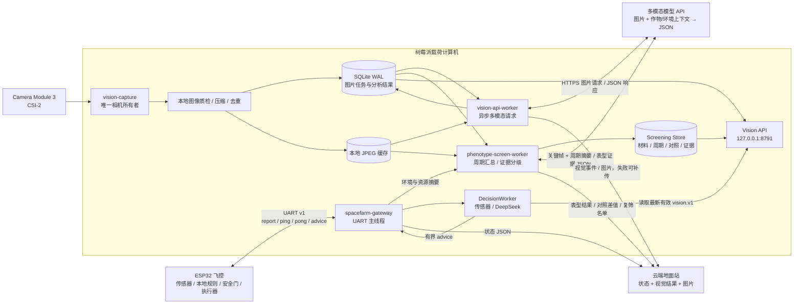

# Camera Module 3 多模态分析与 AI 早期表型筛选架构方案

**状态：** 核心采集、API Worker、Dashboard 接口已实现；云端视觉同步与长期实验待完成
**更新：** 2026-07-03
**适用系统：** ESP32 飞控 + 树莓派载荷计算机 + 云端地面站

## 1. 架构结论

新增视觉能力后仍保持现有“双层自治”原则，但**不在树莓派运行植物识别模型**：

- **ESP32 是飞控**：传感器采样、本地规则、执行器控制和安全护栏不变。
- **树莓派只做图像边缘处理**：Camera Module 3 采集、自动对焦、曝光/清晰度质检、压缩、缓存和任务调度。
- **多模态模型 API 做语义分析**：植物类别、长势、叶片可见异常和育种观察全部由远程多模态模型返回。
- **AI 早期表型筛选形成复筛入口**：把多时点视觉观察、环境稳定性和人工记录汇总成证据化结果，自动生成“值得复筛”的候选名单，但不判定优良品种。
- **视觉结果只作观察输入**：水泵和补光灯仍只能经 `advice → ESP32 安全门 → action` 路径执行，模型不能直控硬件。
- **采集、API 分析与 UART 分进程**：网络请求、重试和图片上传绝不阻塞 115200 UART 心跳。
- **V1 不改 UART 协议**：图片不走 UART。树莓派在本机把最新有效视觉结果与 ESP32 report 融合。

推荐硬件为 **Camera Module 3 Standard 普通版（非 Wide、非 NoIR）**。其 IMX708 具有 4608×2592（11.9MP）、PDAF 自动对焦、HDR 和 CSI-2；标准版 75° 视角比 120° 广角版更适合固定机位下获取较高的单位植株像素，普通版 IR-cut 也更适合分析可见光叶色。[官方硬件规格](https://www.raspberrypi.com/products/camera-module-3/)

树莓派软件采用 Raspberry Pi OS Bookworm 的 `libcamera/rpicam` 与 Picamera2，不使用旧版 `raspistill`/`picamera`。[官方相机软件文档](https://www.raspberrypi.com/documentation/computers/camera_software.html)

## 2. 与现有 DeepSeek 的关系

`tools/pi_advisor.py` 只使用传感器和作物参数生成 `water|light|idle` advice；视觉结果不进入该控制上下文。

截至 2026-06-30，DeepSeek 官方 Chat Completions 文档把 user message 的 `content` 定义为文本字符串，列出的模型为 `deepseek-v4-flash` 和 `deepseek-v4-pro`，没有图片内容块。因此现有 DeepSeek 客户端不能直接承担 Camera Module 3 图像分析。[DeepSeek 官方请求结构](https://api-docs.deepseek.com/api/create-chat-completion)

新架构增加独立的 `MultimodalClient`，通过环境变量选择实际支持图片输入的供应商和模型：

```text
SPACEFARM_VISION_API_URL
SPACEFARM_VISION_API_KEY
SPACEFARM_VISION_MODEL
SPACEFARM_VISION_API_STYLE       # openai_compatible / provider_x
SPACEFARM_VISION_TIMEOUT_SEC
SPACEFARM_VISION_DAILY_LIMIT
```

API key 只放 systemd `EnvironmentFile`，不进入 Git、命令行参数、图片元数据或日志。若未来 DeepSeek 官方 API 增加图片输入，只需增加/切换客户端适配器，不改采集、存储、融合和安全层。

## 3. 目标与非目标

### 3.1 V1 目标

1. 在项目现有 8 种作物内识别植物类别，并允许返回 `unknown`。
2. 分析可见生长阶段、长势、叶色和叶片异常；无法判断的字段必须为 `null/unknown`。
3. 生成定时生长档案、育种观察和异常图片，供地面站展示。
4. 将结构化视觉结果写入独立表型档案和只读大屏，不进入控制决策。
5. API 超时、断网、额度耗尽或返回无效 JSON 时，现有种植闭环不受影响。

### 3.2 V2 早期表型筛选目标

1. 为每份候选材料建立 `材料 → 世代 → 独立周期 → 生长阶段 → 视觉观察` 的可追溯档案。
2. 按“单张照片 → 单日 → 生长阶段 → 独立周期 → 多周期”汇总，避免把重复照片当作独立样本。
3. 输出表型分数、相对同批对照差值、多周期稳定性、数据质量、AI/人工一致性和证据等级。
4. 只在同作物、同阶段、同批次条件下做相对比较，自动形成“复筛候选/继续观察/暂不推荐”清单。
5. 缺少对照、独立周期不足、证据冲突或版本不一致时明确拒绝正式推荐，不用猜测补齐。

### 3.3 树莓派允许做的本地处理

以下属于采集工程，不属于植物语义推理：

- Picamera2 自动对焦、曝光和白平衡控制；
- 根据 AF 状态、亮度直方图和清晰度分数剔除不可用图片；
- 固定 ROI 裁剪、缩放、JPEG 压缩、EXIF 清理和 SHA-256 去重；
- SQLite 任务状态、图片缓存、重试、限额和保留策略；
- 对多模态 API 的 JSON 做类型、范围、枚举和时效校验。
- 对传感器稳定性、用水时长、补光时长和数据覆盖率做确定性的统计汇总。

树莓派**不做**作物分类、病害识别、叶色判断、冠层估算或本地 ML 推理。

### 3.4 非目标

- 不做连续视频分析；植物生长是慢变量，定时静态图成本更可控。
- 不凭单张图片确诊病原体或缺素类型。
- 不让识别结果自动覆盖 OLED 上人工选择的作物类型。
- 不让视觉结果直接启动水泵或补光灯。
- 不把原图或 Base64 图片塞进 `/api/state` 或 UART JSON Line。
- 不声称完成新品种选育、正式 DUS 评价或大田适应性验证。
- 不让 AI 表型评分自动淘汰材料、自动改变种植参数或自动进入下一代育种；AI 只生成复筛建议。

## 4. 目标架构



### 4.1 三条隔离边界

1. **相机隔离**：只有 `vision-capture` 打开 CSI 设备，避免多个进程争抢 Camera Module 3。
2. **网络隔离**：`vision-api-worker` 独立消费 SQLite 任务；API 30 秒超时不影响下一次拍照和 UART。
3. **控制隔离**：多模态返回结果先经 schema 校验和时效门，再作为 DeepSeek 的观察字段；没有直接 GPIO/UART action 权限。

`spacefarm-gateway` 的 UART 主线程仍应把 DeepSeek 等慢任务放到容量为 1 的“最新值队列”。旧报告不排队，始终优先处理最新舱内状态。

## 5. 组件职责

| 组件 | 职责 | 故障时行为 |
|---|---|---|
| `vision-capture` | 独占 Picamera2、定时拍摄、质检、压缩、建立分析任务 | 标记相机故障；不影响网关 |
| `CaptureScheduler` | 定时、人工、作物切换触发；防止并发拍摄 | 忙时合并重复触发，只保留一次待拍 |
| `QualityGate` | 检查 AF 状态、模糊、曝光、文件完整性 | 不合格图不调用收费 API，记录失败原因 |
| `VisionJobStore` | SQLite 状态机、JPEG 缓存、锁租约、重试和保留策略 | 崩溃重启后从未完成任务继续 |
| `vision-api-worker` | 压缩图编码/上传、调用多模态 API、验证 JSON | 失败按策略重试；无结果时不覆盖上次成功结果 |
| `MultimodalClient` | 屏蔽供应商请求格式差异 | 可替换供应商，不影响上层 schema |
| `Vision API` | 仅监听 `127.0.0.1:8791`，发布最新有效结果与健康状态 | 网关短超时读取；失败即忽略视觉 |
| `phenotype-screen-worker` | 聚合日/阶段/周期数据，计算相对对照和稳定性，生成证据等级与复筛名单 | 筛选不可用但不影响视觉分析、决策或飞控 |
| `ScreeningStore` | 保存材料、对照、周期、位置、版本、评分、人工复核和证据 | 数据不足时输出 `insufficient_data`，保留原始观察 |
| `DecisionWorker` | ESP32 report + 作物参数 → DeepSeek advice | 与视觉链隔离；失败则由 ESP32 本地规则兜底 |
| `DashboardSync` | 状态、视觉 JSON、图片分开上传 | 断网写 outbox，恢复后有节制补传 |

systemd 使用软依赖：`spacefarm-gateway.service` 不得 `Requires=spacefarm-vision-*.service`。视觉全停时，网关仍必须启动并运行。

## 6. 采集与 API 分析流水线

```text
定时/人工触发
  → 检查拍摄窗口与任务限额
  → 等待照明、自动曝光和白平衡稳定
  → 自动对焦并记录相机 metadata
  → 拍摄归档图
  → 本地质量门（只判断图片能不能用）
  → 固定 ROI / 缩放 / JPEG 压缩 / hash 去重
  → SQLite: READY
  → API Worker 领取任务: ANALYZING
  → HTTPS 发送图片 + 作物/阶段/传感器上下文
  → 多模态模型返回严格 JSON
  → 本地 schema / enum / range / 语义约束校验
  → SUCCEEDED 或 RETRY_WAIT / DEAD
  → 发布 vision.v1
  → 表型筛选归档 / 地面站同步
```

### 6.1 拍摄默认值

- 自动拍摄的最小间隔为 **2 小时**，且只在光线达标时执行。默认以最新 ESP32 report 的 `light >= 当前作物 light_opt` 为达标；取不到作物参数时使用可配置的 `SPACEFARM_VISION_CAPTURE_LIGHT_MIN`（建议初值 50%）。
- 调度器每 10 分钟检查一次条件：距上次成功拍摄已满 2 小时但光线不足时只顺延，不拍摄、不调用 API，也不为拍照额外开启补光灯；光线恢复后拍摄一次并重新开始 2 小时间隔。
- 作物类型或种植天数变化、人工操作可触发拍摄，但人工触发也应显示当前光线是否达标；是否强制拍摄由操作者明确确认。
- 相机归档图保留较高分辨率；发送给 API 的副本限制长边和 JPEG 大小，建议初值为长边 1280px、质量 80、最大 500KB，均做成配置项。
- 任务队列可保存历史，但分析 Worker 只并发 1 个请求，避免调用风暴。
- 固定机位首次自动对焦；日常优先复用稳定镜头位置，清晰度下降再重新对焦。
- 现有 COB 补光灯若明显偏色，应增加高显色中性白拍摄灯，或在画面固定放置灰卡/色卡；多模态模型也无法凭空恢复缺失的颜色信息。

### 6.2 请求图片方式

`MultimodalClient` 支持两种模式：

1. **内联 Data URL（V1 推荐）**：压缩后的 JPEG 以 Base64 放入 HTTPS 请求；部署简单，不需要公网图片服务器，但会增加约三分之一传输体积。
2. **短时签名 URL**：图片先上传到私有对象存储，API 使用分钟级签名 URL；适合供应商不支持 Data URL 或图片较大时。

禁止使用长期公开 URL。日志只记录图片 hash、字节数和事件 ID，不记录 Base64、签名 URL 或 API key。

### 6.3 概念请求结构

下面是适配器内部的通用表达；具体字段由供应商适配器映射：

```json
{
  "model": "${SPACEFARM_VISION_MODEL}",
  "messages": [
    {
      "role": "system",
      "content": "只根据可见证据分析植物；不可判断时返回 unknown/null；输出严格 JSON。"
    },
    {
      "role": "user",
      "content": [
        {
          "type": "text",
          "text": "作物候选、生长天数、生长阶段、温湿度、土壤、光照及输出 schema"
        },
        {
          "type": "image_url",
          "image_url": {"url": "data:image/jpeg;base64,..."}
        }
      ]
    }
  ],
  "response_format": {"type": "json_schema"}
}
```

若供应商不支持服务端 JSON Schema，则使用 JSON-only prompt，返回后本地验证；失败仅允许一次格式修复请求，仍失败则进入 `RETRY_WAIT`。

## 7. 多模态输出契约 `vision.v1`

```json
{
  "schema": "vision.v1",
  "event_id": "01J...",
  "captured_at": "2026-06-30T10:30:00+08:00",
  "analyzed_at": "2026-06-30T10:30:08+08:00",
  "expected_plant": "生菜",
  "analysis": {
    "plant": "生菜",
    "plant_match": "match",
    "certainty": "high",
    "visible_stage": "vegetative",
    "vigor": "normal",
    "leaf_color": "green",
    "visible_findings": ["叶片展开正常"],
    "possible_issues": [],
    "breeding_observation": "株型紧凑，叶片展开较均匀。",
    "needs_human_review": false
  },
  "quality": {
    "accepted": true,
    "af_state": "focused",
    "blur_score": 181.4,
    "brightness": 0.56
  },
  "model": {
    "provider": "configured-provider",
    "name": "configured-model",
    "version": "provider-reported-version",
    "prompt_version": "plant-vision-v1.0"
  },
  "request": {
    "latency_ms": 4210,
    "attempt": 1,
    "image_sha256": "...",
    "usage": {}
  },
  "image": {
    "thumbnail_url": "/v1/images/01J...-thumb.jpg",
    "archive_path": "2026/06/30/01J....jpg"
  }
}
```

### 7.1 允许值与不确定性

- `analysis.plant` 只允许 8 种配置作物或 `unknown`。
- `plant_match` 只允许 `match|mismatch|unknown`。
- `certainty` 使用 `high|medium|low`，但它是模型自报等级，**不是校准概率**。
- 具体病害或缺素只能放在 `possible_issues`，必须带“可能”；模型不得输出医学式确诊。
- 画面看不到的内容必须为 `unknown/null`，禁止根据作物常识补写成观察事实。
- 数组、字符串长度和枚举均做本地限制，避免异常响应污染大屏或 prompt。

### 7.2 防止误识别

- 质量门失败：不调用 API，不生成植物结论。
- 与人工选择不一致：连续 3 次 `mismatch + high` 才生成告警。
- 即使连续确认，也只请求人工复核，不自动修改 `state.plant_type`。
- 叶片异常需要连续帧或趋势确认，单帧只展示“待复核”。
- 同一图片 hash 的成功分析直接复用，不重复收费调用。

## 8. 与控制链的隔离

视觉服务与控制服务是两条独立链：

```text
传感器 → pi_advisor → advice → ESP32 安全门 → 水泵/补光
Camera Module 3 → 多模态 API → 表型档案/候选筛选 → 只读大屏
```

控制侧不读取视觉 JSON，视觉侧没有 UART advice、GPIO 或执行器权限。模型返回文本即使出现“浇水”“补光”等字样，也只作为不可信观察存档，不能转换成 action。视觉服务停止、结果过期、额度耗尽或 schema 校验失败时，ESP32 与文本控制链照常运行。

---

## 9. 任务状态、重试与成本控制

### 9.1 状态机

```text
CAPTURED → READY → ANALYZING → SUCCEEDED
                    │
                    ├→ RETRY_WAIT → READY
                    └→ DEAD
```

- Worker 领取任务时写租约；进程崩溃后，过期租约可被重新领取。
- 429、5xx、连接失败使用指数退避和随机抖动；4xx schema/鉴权错误不无限重试。
- 默认最多 3 次尝试；成功结果不可被较旧任务覆盖。
- 断网恢复后只优先分析“最新图 + 每日关键帧 + 人工触发图”，不把全部历史任务同时补发。

### 9.2 调用节流

- 自动任务间隔 2 小时且受光线门控，理论上限为 12 次/天；正常 8–12 小时有效光照下约调用 4–6 次。`SPACEFARM_VISION_DAILY_LIMIT` 建议初值设为 12，并为人工触发单独保留少量配额。
- 配置每日调用数、图片字节数和可选费用上限，任何一个达到即停止自动调用。
- 作物切换、人工拍照可以使用单独的小额紧急配额。
- 记录供应商返回的 token/image usage；若供应商不返回，则至少记录请求次数和图片字节数。
- API 配置错误时熔断一段时间，避免周期性产生无效费用或日志。

## 10. 本地存储与地面站

```text
/var/lib/spacefarm/vision/
├── vision.db              # SQLite WAL：任务、结果、用量、模型/prompt 版本
├── images/YYYY/MM/DD/     # 原始归档图
├── api-payloads/          # 临时压缩副本，任务结束后删除
├── thumbnails/            # 大屏缩略图
├── outbox/                # 待补传事件
└── quarantine/            # 质检失败/无效 API 响应，短期保留
```

建议保留策略：

- 元数据与 API 分析结果长期保留；普通原图保留 7 天。
- 每天保留 4 张关键帧；告警、人工标注和误识别图片长期保留。
- 磁盘达到 80% 时先删普通历史图；达到 90% 时停止普通归档，但允许人工拍摄并继续飞控。
- API 请求使用的压缩副本完成后删除，不长期重复占用空间。

地面站不要通过 `/api/state` 承载图片，增加独立接口：

- `POST /api/vision/events`：按 `event_id` 幂等提交 JSON。
- `PUT /api/vision/images/{event_id}`：独立上传 JPEG，限制类型与大小。
- `GET /api/vision/latest`：大屏读取最新结果。
- `/api/state` 只增加 `vision_event_id`、`vision_status` 和 `vision_age_sec`。

## 11. 本机 Vision API

| 方法 | 路径 | 用途 |
|---|---|---|
| `GET` | `/healthz` | 相机、API Worker、额度、磁盘、最近成功时间 |
| `GET` | `/v1/latest` | 最新成功 `vision.v1`，不含图片二进制 |
| `GET` | `/v1/events?limit=N` | 最近视觉任务与状态 |
| `GET` | `/v1/images/{event_id}-thumb.jpg` | 有大小上限的缩略图 |
| `POST` | `/v1/capture` | 本机人工触发，需限频 |
| `POST` | `/v1/events/{event_id}/label` | 人工纠正模型结果 |

API 只绑定 loopback。文件名由服务端事件 ID 生成，不接受任意路径。

## 12. 降级矩阵

| 故障 | 检测 | 降级 |
|---|---|---|
| Camera Module 3 未连接 | Picamera2 初始化失败 | 视觉离线；网关和 ESP32 照常 |
| 图片模糊/过曝 | 本地 QualityGate | 不调用收费 API；等待下次拍摄 |
| 网络中断 | HTTPS 连接失败 | 图片入队；控制链不受影响，网络恢复后选择性补发 |
| API 超时/429/5xx | Worker 响应分类 | 有界重试；UART 不阻塞 |
| API key/模型配置错误 | 401/403/404 | 熔断并告警，不重复调用 |
| API 返回无效 JSON | schema 校验失败 | 最多一次修复请求，之后标记失败 |
| 模型误识别 | 连续帧确认、人工标签 | 不自动改作物，不直接控硬件 |
| 视觉结果过期 | `captured_at` TTL | 大屏标记过期，不进入当前筛选汇总 |
| 每日额度耗尽 | 本地计数器 | 继续拍照缓存；停止自动 API 调用 |
| 磁盘满 | 水位监控 | 清理普通图；仍满则停止归档 |
| 树莓派掉电 | ESP32 UART timeout | ESP32 本地规则自治 |

## 13. 硬件安装

1. **版本**：优先 Camera Module 3 Standard 普通版。
2. **连接**：树莓派 4 及更早旗舰机型用 15-pin Standard-Standard 排线；树莓派 5 使用 22-pin 端口，需要 Standard-Mini 排线。[官方安装说明](https://www.raspberrypi.com/documentation/hardware/camera/picam/)
3. **机位**：镜头垂直向下、刚性固定，画面覆盖种植盘并留约 10% 边缘。
4. **标定**：画面固定放置尺寸标记和灰卡/色卡；相机序列号、ROI 和机位写入配置。
5. **防护**：避开水雾、透明罩反光和灯光直射；镜头窗口可擦拭并防冷凝。
6. **电源**：树莓派与相机使用满足板卡要求的独立稳压电源，不接当前给 ESP32/灯条使用的 AMS1117 支路。官方排障文档提示相机会增加约 200–250mA 负载。[官方相机软件排障说明](https://www.raspberrypi.com/documentation/computers/camera_software.html)
7. **验收**：先以 `rpicam-hello --list-cameras` 和短时拍照确认硬件，再启动服务。

## 14. 建议代码布局

```text
tools/
├── serial_gateway.py                  # UART 主线程；慢任务走最新值队列
├── pi_advisor.py                      # 文本 DeepSeek；新增可选 vision 摘要
└── vision/
    ├── capture_service.py             # Picamera2 唯一所有者
    ├── api_worker.py                  # 远程多模态任务消费者
    ├── camera.py                      # Picamera2 适配层
    ├── scheduler.py                   # 定时/事件触发与合并
    ├── quality.py                     # 只做图片可用性检查
    ├── image_prepare.py               # ROI、缩放、JPEG、hash、EXIF 清理
    ├── job_store.py                   # SQLite 状态机、租约、用量
    ├── schemas.py                     # vision.v1 严格校验
    ├── prompts.py                     # 版本化多模态 prompt
    ├── api.py                         # 127.0.0.1:8791
    ├── config.py                      # 环境变量与限额
    └── clients/
        ├── base.py                    # MultimodalClient 接口
        └── openai_compatible.py       # 图片内容块适配器

tools/screening/
├── screen_worker.py                   # 每日/阶段/独立周期汇总任务
├── aggregator.py                      # 照片→日→阶段→周期→多周期汇总
├── rubric.py                          # 表型维度、门槛和版本
├── schemas.py                         # phenotype_screen.v1 严格校验
├── prompts.py                         # 版本化表型观察 prompt
├── store.py                           # 材料、对照、周期、位置、证据和人工复核
└── evidence.py                        # ΔControl、IQR、稳定性和证据等级

tests/
├── fixtures/vision/                   # 测试图片与脱敏 API 响应
├── test_vision_quality.py
├── test_vision_job_store.py
├── test_vision_schema.py
├── test_vision_api_worker.py          # 注入 fake HTTP，不花真实费用
├── test_vision_fusion.py
├── test_gateway_nonblocking.py
├── test_screening_aggregator.py
├── test_phenotype_screen_schema.py
└── test_evidence_grade.py
```

仓库不需要 `models/` 目录，也不安装 TFLite/ONNX 推理运行时。

## 15. 分阶段实施

### Phase 0：硬件与 API 可行性（1–2 天）

- 固定 Camera Module 3 机位、照明和灰卡。
- 用 `rpicam-*` 连续拍摄，确认自动对焦和色彩稳定。
- 用候选多模态 API 手工测试 8 种作物、空盆、遮挡和低质量图。
- 确认供应商支持的图片输入方式、大小限制、结构化输出和数据保留政策。

**出口：** 相机连续 8 小时定时拍摄稳定；选定 API 能返回可解析的目标 JSON。

### Phase 1：采集与可靠队列（2–3 天）

- 完成 `vision-capture`、质量门、JPEG 缓存、SQLite 状态机和 `/healthz`。
- API 暂用 fake client，先验证进程隔离与崩溃恢复。

**出口：** 拔相机、断网、杀 Worker 时，UART report/ping/pong 仍连续工作，READY 任务不丢失。

### Phase 2：多模态 API 分析（2–4 天）

- 完成 `MultimodalClient`、版本化 prompt、`vision.v1` 校验、重试和每日限额。
- 建立人工标注集，比较 API 对 8 类、`unknown` 和叶片可见异常的表现。

**建议验收目标：** 在真实舱内独立批次图片上，作物 Top-1 ≥ 90%、每类召回率 ≥ 80%；同时统计 `unknown` 拒识与连续三帧后的 mismatch 误报。模型自报 certainty 不作为准确率证据。

### Phase 3：视觉大屏与控制隔离（2–3 天）

- 验证 `pi_advisor` 不读取视觉字段，视觉服务无执行器权限。
- 大屏增加最新图片、分析卡片、调用状态和人工纠错。
- 实现事件/图片分离上传与断网选择性补传。

**出口：** API 失败、结果过期或 schema 错误只影响视觉卡片和筛选；控制链继续使用传感器并经过 ESP32 安全门。

### Phase 4：长期运行与成本校准（至少 7 天）

- 统计准确率、误报、延迟、调用量、图片字节、供应商用量和服务重启。
- 根据实际效果调整拍摄间隔、图片尺寸、prompt 和每日限额。
- 模型或 prompt 变化必须保留版本，防止时间序列前后口径混乱。

### Phase 5：AI 早期表型筛选与复筛候选（5–10 天）

- 建立材料、固定对照、独立周期、盆位、ROI 和人工复核数据结构。
- 固化按作物/阶段区分的表型量表，并用历史图片回放校准。
- 实现单张照片→单日中位数→阶段中位数/趋势→单周期→多周期的层级汇总。
- 输出相对同批对照差值、IQR、优于对照的周期比例、数据质量和证据等级。
- 大屏增加证据卡、周期明细和复筛候选名单，由育种人员确认并写回原因。

**出口：** 每个结果都能追溯到固定对照、独立周期、位置、量表、模型/prompt、视觉事件和人工复核；少于 3 个独立周期或无有效对照时不得给出正式推荐。

## 16. 最小验收清单

- [ ] 树莓派未安装、未运行任何本地植物识别模型。
- [ ] Camera Module 3 能被 `rpicam-hello --list-cameras` 识别。
- [ ] `vision-capture` 独占相机，API 超时不影响下一次拍照。
- [ ] 低质量图片在本地被拒绝，不产生收费调用。
- [ ] 自动拍摄满足“光线达标 + 距上次成功拍摄至少 2 小时”；光线不足时顺延且不会自动开灯。
- [ ] 图片通过 HTTPS 发送给已确认支持图像输入的多模态 API。
- [ ] DeepSeek 文本 API 与多模态 API 使用独立配置和客户端。
- [ ] 无效 JSON、越界字段和未知枚举不会进入大屏或决策 prompt。
- [ ] 人工作物类型不会被视觉自动修改。
- [ ] 图片不经过 UART，也不进入 `/api/state`。
- [ ] 拔相机、停 Worker、断网、额度耗尽时 ESP32 仍执行本地规则。
- [ ] 多模态结果不会直接生成执行器命令。
- [ ] DeepSeek 最终 advice 仍经过 action 白名单和 ESP32 安全门。
- [ ] 每日调用上限、重试上限、断网补发策略和图片保留策略已验证。
- [ ] AI 表型筛选只比较同作物、同阶段、同批次材料，并优先使用同批固定对照。
- [ ] 每 2 小时照片仅作为重复测量，独立样本量按完整种植周期计算。
- [ ] 结果包含分项、ΔControl、IQR、优于对照周期比例、数据质量、证据 ID 和版本。
- [ ] 自动筛选只生成复筛候选，最终判断必须由育种人员确认并留痕。

## 17. 网页端改造方案

网页端需要同时表达四条互不等价的数据链：

1. **实时遥测**：ESP32 → UART → 树莓派 → `/api/state`，约 3 秒刷新一次。
2. **视觉观察**：Camera Module 3 → 2 小时光线门控拍摄 → 多模态 API，分钟/小时级更新。
3. **控制决策**：传感器 + 作物参数 → DeepSeek → ESP32 安全门；不读取视觉结果。
4. **早期表型筛选**：多时点视觉结果 + 同批对照 + 多周期汇总 → 证据等级 → 复筛候选名单。

页面不能把三者混成一个“AI 在线”标签，也不能把两小时前的静态图片伪装成实时视频。

### 17.1 页面布局

在现有任务条和三列主网格之间新增全宽“视觉载荷”区域：

```text
┌────────────────────────────── 顶部任务条 ──────────────────────────────┐
│ ESP32 飞控 · 树莓派载荷 · Camera Module 3 · 多模态 API · 当前时间      │
├────────────────────────────── 视觉载荷 ────────────────────────────────┤
│ ┌──────────── 最近拍摄（非实时视频） ───────────┐ ┌──── 多模态观察 ───┐ │
│ │                 16:9 JPEG                     │ │ 作物匹配：一致     │ │
│ │ 拍摄时间 / 图像状态 / 事件 ID                 │ │ 生长阶段：营养期   │ │
│ └───────────────────────────────────────────────┘ │ 长势/叶色/可见异常 │ │
│ 拍摄策略：每 2h · 当前光照 55 / 门槛 50 · 下次最早 14:30 · 等待间隔     │
├──────────────────────────── 早期表型筛选 ──────────────────────────────┤
│ 表型 82 · Δ对照 +7 · 3/3周期较优 · IQR 2.0 · 数据87% · [B级·建议复筛]     │
├──────────────┬───────────────────────┬─────────────────────────────────┤
│ 作物/传感器   │ 趋势图/AI 决策链       │ 执行器/系统健康/团队              │
└──────────────┴───────────────────────┴─────────────────────────────────┘
```

视觉区域包含：

- 最新图片，标题必须写“最近拍摄”，显示 `captured_at` 和距今时间。
- 相机状态：`在线|离线|拍摄中`。
- 调度状态：`等待 2 小时间隔|等待光线|可拍摄|分析中|重试等待|已完成`。
- 光线门控：当前 `light`、门槛 `light_opt`、是否通过。
- 下次最早拍摄时间；光线不足时显示“已到时间，等待光线改善”。
- 多模态结果：人工选定作物/识别作物、match 状态、certainty、生长阶段、长势、叶色、可见发现、可能问题和育种观察。
- 模型元数据：供应商、模型、prompt 版本和分析时间放在可折叠详情中，不占主视觉。
- 最近 4 次图片缩略图作为生长时间线，点击只查看，不触发任何硬件动作。
- AI 早期表型证据卡：表型分、相对同批对照差值、独立周期数、IQR、优于对照周期比例、数据质量和 A/B/C/D 证据等级。
- 分项条形图：生长势、目标株型、叶色健康、可见异常/抗逆、表型一致性和低权重资源响应参考。
- 周期趋势：照片先聚合为日/阶段/周期结果；图表以独立周期为点，不能把每 2 小时照片画成独立样本。
- “查看证据”展开固定对照、位置轮换、视觉事件、环境摘要和人工复核；“建议复筛”必须带“非优良品种结论”标记。

### 17.2 状态颜色

| 状态 | 颜色 | 页面文案 |
|---|---|---|
| `SUCCEEDED` 且未过期 | 绿色 | 分析完成 |
| `WAITING_INTERVAL` | 灰色 | 等待 2 小时间隔 |
| `WAITING_LIGHT` | 琥珀色 | 光线不足，拍摄顺延 |
| `CAPTURING/ANALYZING` | 青色脉冲 | 拍摄中 / 多模态分析中 |
| `RETRY_WAIT` | 琥珀色 | API 暂不可用，等待重试 |
| `CAMERA_OFFLINE/API_ERROR` | 红色 | 相机离线 / 分析服务异常 |
| 超过 3 小时 | 琥珀色 | 视觉结果已过期，不进入当前筛选汇总 |
| 无首张图片 | 灰色 | 等待首次满足光线条件的拍摄 |

视觉故障只影响视觉卡片，不能让整个网页切到演示模式；传感器仍在线时必须继续显示真实遥测。

### 17.3 AI 决策链调整

现有三步链改为四步：

```text
输入 · 环境传感器
  ↓
观察 · Camera Module 3 / 多模态模型
  ↓
判断 · DeepSeek 决策
  ↓
输出 · ESP32 安全门与执行器
```

若视觉无结果、过期或校验失败，视觉区域明确显示原因，不隐藏或伪造结果；传感器控制区域继续独立显示 ESP32 安全门状态。

当前页面的 `buildBreedingObservation()` 会用传感器模板生成育种文本；改造后应拆分：

- `vision.analysis.breeding_observation` 显示为“多模态育种观察”；
- `/api/state.breeding_observation` 显示为“决策备注”；
- 没有真实视觉结果时，不得生成类似“叶片展开正常”的图像观察。

当前页面还会为规则诊断生成 `0.68/0.74` 等模拟可信度。应删除这些百分比：传感器规则显示“正常/告警”，多模态模型只显示其自报的 `high|medium|low` certainty，并注明“模型自报，非校准概率”。

### 17.4 浏览器接口与刷新频率

保留现有接口，并增加视觉只读接口：

| 浏览器请求 | 频率 | 作用 |
|---|---:|---|
| `GET /api/state` | 3 秒 | ESP32 实时遥测、动作和决策 |
| `GET /api/vision/status` | 30 秒 | 相机、Worker、光线门控、调度和额度 |
| `GET /api/vision/latest` | 30 秒 | 最新 `vision.v1` |
| `GET /api/vision/events?limit=4` | 60 秒 | 最近图片时间线 |
| `GET /api/vision/images/{event_id}` | 事件 ID 变化时 | 加载不可变 JPEG/缩略图 |
| `GET /api/screening/latest?material_id=...` | 5 分钟 | 当前材料最新表型证据结果 |
| `GET /api/screening/cohorts/{cycle_group_id}` | 5 分钟 | 同批对照、多周期差值和复筛建议 |

图片 URL 使用 `event_id` 作为版本，不要每 3 秒追加随机参数重复下载。服务端为图片返回 `ETag` 和长缓存；JSON 使用 `no-store` 或短缓存。

前端维护两个独立的最近成功状态：`lastTelemetry` 和 `lastVision`。遥测失败遵循当前容错逻辑；视觉失败则保留最近图片并加“过期/离线”遮罩，绝不回退到虚构的视觉 mock。

### 17.5 云端 dashboard_server 接口

当前 `dashboard_server.py` 只有内存中的 `/api/state`，且请求上限为 4KB。视觉接入需新增独立存储和接口：

| 方法 | 路径 | 调用方 | 说明 |
|---|---|---|---|
| `POST` | `/api/vision/status` | 树莓派 Worker | 上报相机/调度/API 状态 |
| `POST` | `/api/vision/events` | 树莓派 Worker | 按 `event_id` 幂等写 `vision.v1` |
| `PUT` | `/api/vision/images/{event_id}` | 树莓派 Worker | 上传有限大小的 JPEG |
| `GET` | `/api/vision/status` | 浏览器 | 读取视觉链健康状态 |
| `GET` | `/api/vision/latest` | 浏览器 | 读取最新成功结果 |
| `GET` | `/api/vision/events?limit=4` | 浏览器 | 最近事件 |
| `GET` | `/api/vision/images/{event_id}` | 浏览器 | 获取图片或缩略图 |
| `POST` | `/api/screening/results` | 树莓派筛选 Worker | 幂等上传 `phenotype_screen.v1` |
| `GET` | `/api/screening/latest` | 浏览器 | 当前材料最新证据结果 |
| `GET` | `/api/screening/cohorts/{cycle_group_id}` | 浏览器 | 同批对照与多周期汇总 |
| `GET` | `/api/screening/materials/{material_id}/timeline` | 浏览器 | 材料的阶段/周期证据时间线 |

服务端要求：

- 视觉 JSON 和图片使用不同大小上限，不能放宽现有 `/api/state` 的 4KB 限制。
- 元数据写 SQLite，图片写专用目录；服务重启后仍可展示上一张图片。
- 写接口使用 `DASHBOARD_TOKEN` 或独立 `VISION_UPLOAD_TOKEN`；同源 GET 不开放任意文件路径。
- 只接受 `image/jpeg`，校验事件 ID、文件签名、字节数和 SHA-256，禁止目录穿越。
- `vision.v1` 和 `phenotype_screen.v1` 的枚举、字符串长度、时间戳、数组长度全部白名单校验；ΔControl、中位数、IQR 和证据等级由服务端复算。
- 多模态文本属于不可信输入。前端使用 `textContent`，不能像当前 `renderSignals()`、`renderLog()` 一样把模型文本拼进 `innerHTML`。
- 生产环境同源访问，CORS 不再默认 `*`；如确需跨域则配置明确 origin。

### 17.6 网页保持只读

当前架构规定云端大屏没有反向控制通道，因此页面**不增加**“立即拍照”“重新分析”“开启补光”或“执行浇水”按钮。人工拍摄只通过树莓派本地 API/命令或现场物理操作完成。

若未来确实需要远程控制，必须另立带认证、审计、过期时间和 ESP32 安全确认的命令通道，不能复用视觉 GET/POST 接口偷渡控制指令。

### 17.7 需要修改的文件

| 文件 | 修改内容 |
|---|---|
| `deliverables/groundstation.html` | 新增视觉载荷区、四步决策链、缩略图时间线、安全文本渲染，以及早期表型证据卡、ΔControl、多周期稳定性和人工复核状态 |
| `tools/dashboard_server.py` | 视觉状态/事件/图片及表型筛选 API、SQLite/图片存储、认证、校验和缓存 |
| `tools/serial_gateway.py` | `/api/state` 只携带 `vision_event_id/status/age` 摘要，不携带图片 |
| `tests/test_dashboard_server.py` | 视觉 schema、鉴权、大小限制、路径穿越、幂等和图片读取测试 |
| 新增前端测试 | 视觉离线不影响遥测、2 小时/光线状态、过期遮罩、XSS 字符串安全 |
| 新增表型筛选测试 | 照片不计独立 n、无对照/周期不足拒绝推荐、版本断点、IQR、人工复核 |

建议实施顺序：先完成服务端视觉 API 和测试，再改网页 mock/布局，最后接树莓派 Worker 上传；不要先把页面写死在尚不存在的接口上。

## 18. AI 早期表型筛选系统

### 18.1 科学定位与结论边界

本系统定位为：

> **单舱环境下的 AI 辅助植物表型观察与早期筛选系统。**

它利用可见光图像做非破坏、连续观察，并把同批对照和多周期重复汇总成“值得进入下一轮复筛”的候选名单。图像技术可用于受控环境中的株型、生长和胁迫表型观察，但图像或 AI 输出并不能代替实验设计。[植物表型成像综述](https://www.mdpi.com/1424-8220/14/11/20078)

当前单舱装置不能证明大田适应性，也不能完成新品种的特异性、一致性和稳定性正式评价；UPOV 的 DUS 测试有独立、作物专用的规范。[UPOV DUS 指南](https://www.upov.int/en/find-and-explore/information-and-guidance/examination-guidance/test-guidelines)

允许的结论是：

```text
候选 A 在多个单舱独立周期中相对同批对照表现稳定较优，建议进入复筛。
```

禁止的结论是：

```text
候选 A 已被证明为优良品系 / 本系统已经培育出新品种。
```

该系统不参与 60 秒控制循环，也没有执行器权限。

### 18.2 单装置最小实验设计

每个独立种植周期放置 4 盆同种作物：

```text
1 盆固定对照 + 候选 A + 候选 B + 候选 C
```

每个材料在单周期只有 1 盆，因此一个周期只能提供弱证据。每 2 小时照片是同一实验单元的重复测量，不增加独立样本数。植物科学实验中，把同一实验单元的子样本或重复观测当成独立重复会造成伪重复并夸大证据。[独立重复与伪重复说明](https://academic.oup.com/jxb/article/72/15/5270/6329731)

| 完整独立周期数 | 系统可给出的表述 |
|---:|---|
| 1 | 观察记录，不推荐 |
| 2 | 初步迹象 |
| 3 | 可给出初筛建议 |
| 5 | 趋势较可信 |
| 8–10 | 才更适合讨论统计稳定性 |

中小学生科创项目以 **3 个周期为最低、5 个周期为推荐目标**。独立 `n` 按完整周期计，不按照片数、ROI 数或 API 调用数计。

位置固定为 `P1–P4`，每周期轮换：

| 周期 | P1 | P2 | P3 | P4 |
|---|---|---|---|---|
| 1 | 对照 | A | B | C |
| 2 | A | B | C | 对照 |
| 3 | B | C | 对照 | A |
| 4 | C | 对照 | A | B |

必须记录 `position_id`、`ROI_id`、该位置光照、遮挡、相机位置版本和人工干预。位置轮换只能减弱位置偏差，不能消除单舱共享环境带来的依赖性。

### 18.3 比较优先级

1. **同批固定对照——主要依据**：同一时间、舱体、光照、浇水、相机和模型版本，最能抵消环境波动。
2. **装置历史基线——批次质控**：判断整批是否因季节、设备或种子活力异常；不作为主要优选依据。
3. **上一代——辅助趋势**：只有同作物、同目标性状、相似环境、相同版本且周期足够时才展示代际变化。

核心量为每个独立周期内：

```text
ΔControl = 候选周期表型分 − 同批对照周期表型分
```

跨周期使用 `ΔControl` 的中位数、IQR 和优于对照的周期比例，不以最高分或单次排名作为结论。

原 `60% 同批 + 25% 历史 + 15% 上一代` 只保留为可选的 `Evidence Index`，不能成为页面唯一输出；历史或上一代不可比时对应项必须为 `null`，不能偷偷重新分配或补猜。

### 18.4 多时点汇总层级

```text
单张照片（技术重复）
  ↓ 当日有效照片中位数
单日表型
  ↓ 阶段内日评分中位数 + 生长趋势
阶段表型
  ↓ 作物专用阶段权重
单周期表型
  ↓ 多周期 ΔControl 中位数 / IQR / 优于对照比例
早期筛选证据
```

- 单张照片先过清晰度、曝光、ROI、遮挡和模型可判断性检查。
- 单日取有效照片中位数，降低偶发图片异常影响。
- 阶段分建议初值为 `70% 阶段日评分中位数 + 30% 生长趋势`。
- 单周期阶段权重必须按作物配置；叶菜可使用出苗 20%、幼苗 30%、营养生长 40%、后期稳定 10% 作为待校准初值。
- 多周期不直接平均全部照片；统计单位始终是独立周期。

### 18.5 表型量表

共享水泵、补光灯和单个土壤传感器无法把资源消耗归因到单盆，因此把原“资源效率 20 分”降为“资源响应参考 5 分”：

| 维度 | 权重 | 主要证据 | 限制 |
|---|---:|---|---|
| 生长势 `vigor` | 30 | 多时点可见生长和阶段进展 | 单帧大小不等于生长速度 |
| 目标株型 `morphology` | 20 | 紧凑度、叶形、节间或目标性状 | 按作物目标配置 |
| 叶色健康度 `leaf_health` | 15 | 叶色、黄化和可见均匀性 | 受照明/白平衡影响 |
| 可见异常/抗逆 `visible_resilience` | 15 | 胁迫后恢复和可见异常 | 没有实际胁迫时标记证据不足 |
| 表型一致性 `consistency` | 15 | 多时点与多周期稳定程度 | 单周期不能证明稳定性 |
| 资源响应参考 `resource_response` | 5 | 相同舱级资源条件下的相对表现 | 不是单株资源效率 |

AI 返回分项观察和证据，本地按固定量表计算 `phenotype_score`。页面不得把“资源响应参考”表述成“候选 A 比候选 B 更省水”。

### 18.6 数据门槛与证据等级

先判门槛，再计算推荐：

```text
无同批有效对照                  → insufficient_data
独立周期 < 3                    → preliminary_only
模型/prompt/量表版本不一致且未重跑 → model_version_inconsistent
对照死亡或严重异常               → batch_invalid
计划图片有效率 < 60%             → low_data_quality
```

正式输出不是单一总分，而是：

```text
Phenotype Score + ΔControl + Stability + Data Quality
+ AI/Human Agreement + Evidence Grade + Recommendation
```

| 等级 | 建议条件 | 表述 |
|---|---|---|
| A | ≥5 周期，多数周期优于对照，数据质量高，人工复核一致 | 强复筛候选 |
| B | ≥3 周期，整体优于对照，波动可接受 | 建议复筛 |
| C | 有亮点但周期不足、波动较大或数据质量一般 | 继续观察 |
| D | 多数独立周期不如对照 | 暂不推荐复筛 |
| `insufficient_data` | 缺对照、周期不足、版本冲突或严重缺失 | 不给等级 |

证据等级规则必须版本化。A/B/C/D 只代表本装置内早期筛选证据，不等于新品种等级。

### 18.7 输出契约 `phenotype_screen.v1`

```json
{
  "schema": "phenotype_screen.v1",
  "result_id": "01J...",
  "material_id": "LET-G4-A",
  "control_material_id": "LET-CTRL",
  "cycle_group_id": "LETTUCE-G4-2026-A",
  "crop": "生菜",
  "stage": "vegetative",
  "status": "screened",
  "independent_cycles": 3,
  "dimensions": {
    "vigor": {"score": 84, "weight": 30},
    "morphology": {"score": 88, "weight": 20},
    "leaf_health": {"score": 81, "weight": 15},
    "visible_resilience": {"score": 76, "weight": 15},
    "consistency": {"score": 82, "weight": 15},
    "resource_response": {"score": 70, "weight": 5}
  },
  "phenotype_score": 82.0,
  "delta_control": {
    "median": 7.0,
    "iqr": 2.0,
    "better_cycles": 3,
    "total_cycles": 3
  },
  "historical_baseline": {"comparable": true, "zscore": 0.8},
  "previous_generation": {"comparable": false, "delta": null},
  "data_quality": {
    "planned_images": 60,
    "valid_images": 52,
    "coverage": 0.87
  },
  "ai_human_agreement": 0.85,
  "evidence_grade": "B",
  "recommendation": "rescreen_candidate",
  "summary": "3 个独立周期均高于同批对照，波动较小，建议复筛。",
  "limitations": ["单舱共享资源；不能评价单株资源效率"],
  "versions": {
    "device": "cabin-v1",
    "camera_position": "cam-pos-v1",
    "model": "configured-model",
    "prompt": "phenotype-v1.0",
    "rubric": "lettuce-veg-v2.0"
  },
  "review": {"required": true, "status": "pending"}
}
```

服务端必须复算权重、`phenotype_score`、ΔControl 中位数、IQR、周期比例和证据等级。多模态模型不能自行决定独立 `n`、最终等级或排名。

### 18.8 数据记录

最低记录字段：

- 样品：`plant_id, pot_id, material_id, crop, is_control, generation, seed_batch, cycle_id, position_id, ROI_id`。
- 时间：播种、出苗、生长阶段开始/结束和采收日期。
- 环境：温度、湿度、土壤湿度、光照、泵/灯状态、动作时长、安全告警、人工干预。
- 图像：`image_id, plant_id, cycle_id, stage, path, ROI, quality, blur, brightness, occlusion`。
- AI：模型、prompt、原始 JSON、各分项、certainty 和人工复核结果。
- 不确定性：有效/计划图片数、缺失率、阶段波动、多周期中位数、IQR、优于对照比例和 AI/人工一致率。
- 版本：设备、相机位置、灯具、传感器校准、模型、prompt 和量表版本。

模型或 prompt 变化时，旧图应使用新版本重跑；无法重跑则在趋势图显示版本断点，不直接比较。

### 18.9 成本、降级与后续硬件

- 表型筛选使用独立 `SPACEFARM_SCREENING_DAILY_LIMIT`；每日汇总最多一次，阶段/周期汇总按事件触发。
- API 失败时保留待处理任务；飞控与传感器控制决策继续独立运行。
- 无法筛选时显示真实状态，不生成模拟分数。
- 若未来要评价单株资源效率，需要每盆独立土壤传感器或称重、分区水泵/阀门和分区光照记录；在此之前资源效率只能是舱级指标。
